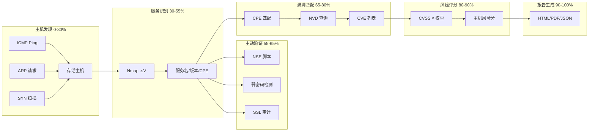
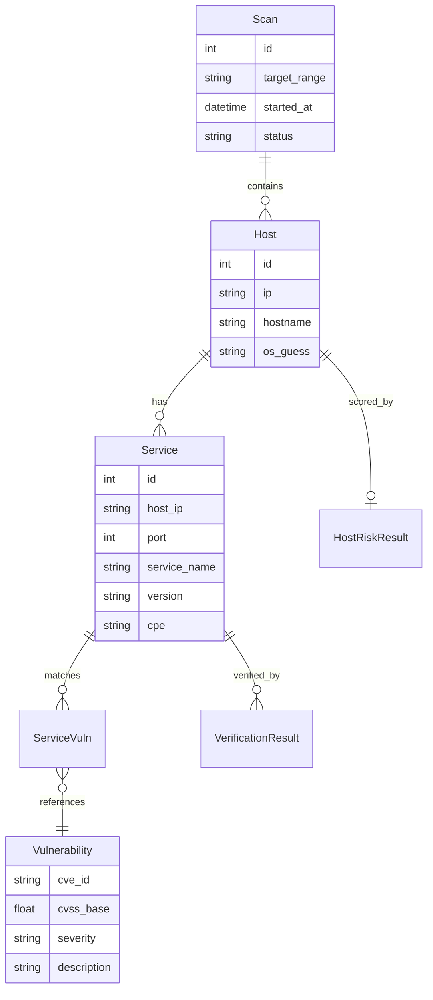

# 系统架构设计

> 从宏观视角理解 VulnScanner 的工作原理

---

## 一句话理解

**VulnScanner** 是一个网络脆弱性扫描与风险评估系统：
1. 发现网络中的主机
2. 识别主机上运行的服务
3. 匹配已知漏洞（CVE）
4. 计算风险评分
5. 生成报告

---

## 项目目录结构

```
vuln_scanner/
│
├── cli/                          # 命令行界面
│   └── main.py                   # CLI 入口，所有命令定义在这里
│
├── web/                          # Web 界面
│   ├── app.py                    # Flask 应用启动
│   ├── api.py                    # REST API 接口
│   ├── views.py                  # HTML 页面路由
│   ├── templates/                # Jinja2 HTML 模板
│   └── static/                   # CSS、JS 静态文件
│
├── src/vulnscan/                 # 核心业务逻辑（重点！）
│   ├── core/                     # 核心模块
│   │   ├── models.py            # 数据模型（Host、Service、Vulnerability 等）
│   │   ├── pipeline.py          # 扫描流水线（6 阶段编排）
│   │   ├── scoring.py           # 风险评分算法
│   │   └── diff.py              # 扫描结果对比
│   │
│   ├── scanners/                 # 扫描器
│   │   ├── discovery/           # 主机发现（ICMP、ARP、SYN）
│   │   └── service/             # 服务识别（Nmap）
│   │
│   ├── nvd/                      # NVD 漏洞库集成
│   │   ├── client.py            # NVD API 客户端
│   │   ├── cache.py             # 本地缓存
│   │   └── matcher.py           # 漏洞匹配器
│   │
│   ├── verifiers/                # 主动验证
│   │   ├── nse.py               # Nmap 脚本验证
│   │   ├── weak_creds.py        # 弱密码检测
│   │   └── ssl_audit.py         # SSL/TLS 审计
│   │
│   ├── remediation/              # 修复建议
│   ├── reporting/                # 报告生成
│   └── storage/                  # 数据存储
│
├── data/                         # 运行时数据
│   ├── scanner.db               # SQLite 数据库
│   └── nvd_cache/               # NVD 缓存文件
│
├── demo/                         # 演示环境（Docker 靶场）
└── docs/                         # 文档
```

---

## 系统分层架构

```
┌─────────────────────────────────────────────────────────────┐
│                       用户界面层                             │
│  ┌──────────────────┐    ┌──────────────────┐              │
│  │   CLI (Click)    │    │  Web (Flask)     │              │
│  │   cli/main.py    │    │  web/app.py      │              │
│  └────────┬─────────┘    └────────┬─────────┘              │
└───────────┼───────────────────────┼─────────────────────────┘
            │                       │
            ▼                       ▼
┌─────────────────────────────────────────────────────────────┐
│                       业务逻辑层                             │
│  ┌─────────────────────────────────────────────────────┐   │
│  │              ScanPipelineRunner                      │   │
│  │              (core/pipeline.py)                      │   │
│  │  ┌─────────────────────────────────────────────┐    │   │
│  │  │ 阶段1:主机发现 → 阶段2:服务识别 → 阶段3:验证 │    │   │
│  │  │ 阶段4:漏洞匹配 → 阶段5:风险评分 → 阶段6:报告 │    │   │
│  │  └─────────────────────────────────────────────┘    │   │
│  └─────────────────────────────────────────────────────┘   │
│                                                             │
│  ┌──────────┐ ┌──────────┐ ┌──────────┐ ┌──────────┐       │
│  │ Scanners │ │Verifiers │ │   NVD    │ │ Scoring  │       │
│  └──────────┘ └──────────┘ └──────────┘ └──────────┘       │
└─────────────────────────────────────────────────────────────┘
            │
            ▼
┌─────────────────────────────────────────────────────────────┐
│                       数据存储层                             │
│  ┌──────────────────┐    ┌──────────────────┐              │
│  │  SQLite 数据库    │    │   NVD 缓存       │              │
│  │  (storage/)      │    │   (nvd/cache.py) │              │
│  └──────────────────┘    └──────────────────┘              │
└─────────────────────────────────────────────────────────────┘
```

---

## 核心数据流

一次完整的扫描从开始到生成报告，经历 6 个阶段：



### 各阶段详解

| 阶段 | 进度 | 功能 | 核心代码 |
|------|------|------|----------|
| 1. 主机发现 | 0-30% | 发现存活主机 | `scanners/discovery/` |
| 2. 服务识别 | 30-55% | 识别端口和服务 | `scanners/service/nmap.py` |
| 3. 主动验证 | 55-65% | 弱密码、SSL 等检测 | `verifiers/` |
| 4. 漏洞匹配 | 65-80% | 匹配 CVE 漏洞 | `nvd/matcher.py` |
| 5. 风险评分 | 80-90% | 计算风险分数 | `core/scoring.py` |
| 6. 报告生成 | 90-100% | 生成报告 | `reporting/generator.py` |

---

## 数据模型关系



---

## 技术选型

| 层次 | 技术 | 选型理由 |
|------|------|----------|
| CLI 框架 | Click | Python 最流行的 CLI 库，装饰器语法简洁 |
| Web 框架 | Flask | 轻量级，适合中小型项目，易于扩展 |
| 数据库 | SQLite | 零配置，单文件，适合单机部署 |
| 网络扫描 | Scapy + Nmap | Scapy 灵活发包，Nmap 服务识别准确 |
| 漏洞数据 | NVD API | 官方权威数据源，免费开放 |
| PDF 生成 | WeasyPrint | 纯 Python 实现，支持 CSS 样式 |
| 图表 | ECharts + matplotlib | 前端交互用 ECharts，PDF 用 matplotlib |

---

## 扩展点

系统设计了多个扩展点，方便添加新功能：

### 1. 添加新扫描器

实现 `Scanner` 抽象类：

```python
# src/vulnscan/core/base.py
class Scanner(ABC):
    @abstractmethod
    def scan(self, context: ScanContext) -> ScanResult:
        pass
```

详见 [如何添加新扫描器](development/extending_scanners.md)

### 2. 添加新验证器

实现 `ServiceVerifier` 抽象类：

```python
# src/vulnscan/verifiers/base.py
class ServiceVerifier(ABC):
    @abstractmethod
    def verify(self, services: List[Service]) -> List[VerificationResult]:
        pass
```

详见 [如何添加新验证器](development/extending_verifiers.md)

---

## 配置管理

所有配置集中在 `src/vulnscan/config.py`：

```python
@dataclass
class Config:
    database: DatabaseConfig    # 数据库路径
    nvd: NVDConfig             # NVD API 配置
    scan: ScanConfig           # 扫描参数
    web: WebConfig             # Web 服务配置
```

支持环境变量覆盖：

```bash
export VULNSCAN_DB_PATH=/path/to/scanner.db
export VULNSCAN_NVD_API_KEY=your-api-key
```

---

## 下一步

- [核心模块详解](modules/01_core.md) - 深入理解数据模型和扫描流水线
- [扫描器模块](modules/02_scanners.md) - 了解主机发现和服务识别原理
- [风险评分模块](modules/04_scoring.md) - 理解风险量化算法
