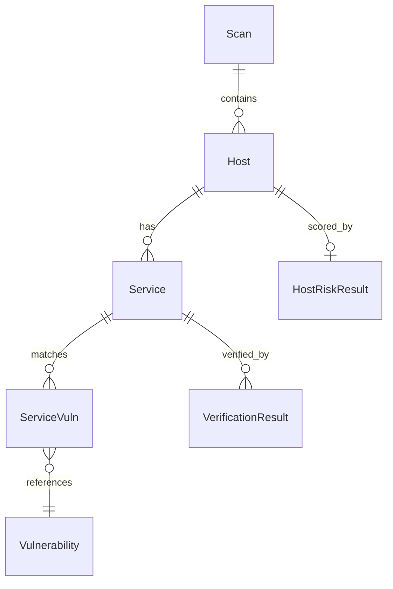
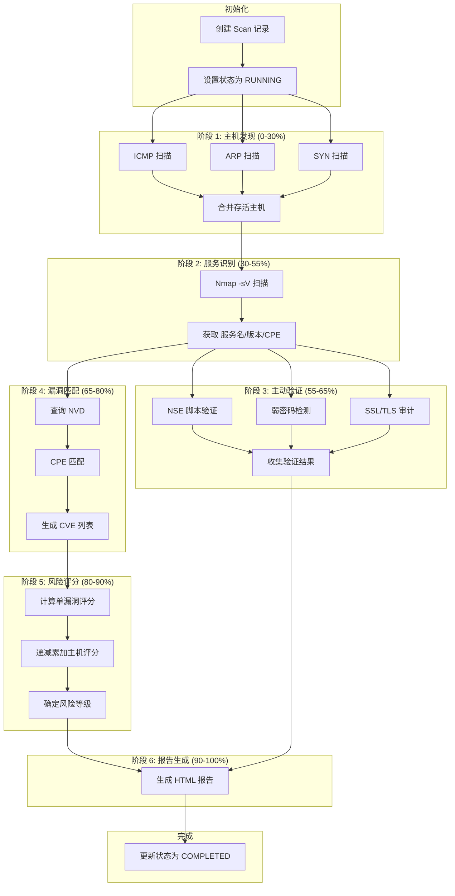

# 核心模块

> 理解 VulnScanner 的数据模型和扫描流水线

---

## 模块概述

核心模块位于 `src/vulnscan/core/`，包含系统最基础的组件：

| 文件 | 功能 |
|------|------|
| `models.py` | 数据模型定义（主机、服务、漏洞等） |
| `pipeline.py` | 扫描流水线编排（6 阶段扫描流程） |
| `base.py` | 扫描器基类和上下文传递 |
| `scoring.py` | 风险评分算法 |
| `diff.py` | 扫描结果对比 |

---

## 1. 数据模型 (models.py)

### 模型关系图



### 1.1 枚举类型

#### ScanStatus - 扫描状态

```python
class ScanStatus(Enum):
    PENDING = "pending"      # 等待中
    RUNNING = "running"      # 运行中
    COMPLETED = "completed"  # 已完成
    FAILED = "failed"        # 失败
```

#### PortState - 端口状态

```python
class PortState(Enum):
    OPEN = "open"        # 开放
    CLOSED = "closed"    # 关闭
    FILTERED = "filtered" # 被过滤（防火墙阻挡）
```

#### RiskLevel - 风险等级

```python
class RiskLevel(Enum):
    CRITICAL = "Critical"  # 严重
    HIGH = "High"          # 高危
    MEDIUM = "Medium"      # 中危
    LOW = "Low"            # 低危
    INFO = "Info"          # 信息
```

#### Severity - 漏洞严重程度

```python
class Severity(Enum):
    CRITICAL = "CRITICAL"  # CVSS >= 9.0
    HIGH = "HIGH"          # CVSS >= 7.0
    MEDIUM = "MEDIUM"      # CVSS >= 4.0
    LOW = "LOW"            # CVSS < 4.0
```

---

### 1.2 Host - 主机信息

代表网络中发现的一台主机。

```python
@dataclass
class Host:
    ip: str                           # 必填：IP 地址
    id: Optional[int] = None          # 数据库主键
    scan_id: Optional[int] = None     # 所属扫描任务 ID
    mac: Optional[str] = None         # MAC 地址（ARP 扫描获取）
    hostname: Optional[str] = None    # 主机名（DNS 反解）
    os_guess: Optional[str] = None    # 操作系统猜测
    is_alive: bool = True             # 是否存活
```

**字段来源**：

| 字段 | 数据来源 | 获取方式 |
|------|----------|----------|
| `ip` | 主机发现阶段 | ICMP/ARP/SYN 扫描 |
| `mac` | ARP 扫描 | Scapy ARP 请求 |
| `hostname` | DNS 反解 | 反向 DNS 查询 |
| `os_guess` | 服务识别阶段 | Nmap OS 检测 |

---

### 1.3 Service - 服务信息

代表主机上运行的网络服务。

```python
@dataclass
class Service:
    host_ip: str                      # 必填：所属主机 IP
    port: int                         # 必填：端口号
    proto: str = "tcp"                # 协议（tcp/udp）
    id: Optional[int] = None          # 数据库主键
    host_id: Optional[int] = None     # 所属主机 ID
    service_name: Optional[str] = None # 服务名（如 http、ssh）
    product: Optional[str] = None     # 产品名（如 Apache、OpenSSH）
    version: Optional[str] = None     # 版本号（如 2.4.52）
    cpe: Optional[str] = None         # CPE 标识符（用于漏洞匹配）
    state: PortState = PortState.OPEN # 端口状态
    banner: Optional[str] = None      # 服务 Banner
```

**CPE（Common Platform Enumeration）示例**：

```
cpe:2.3:a:apache:http_server:2.4.52:*:*:*:*:*:*:*
     │   │      │           │
     │   │      │           └── 版本号
     │   │      └────────────── 产品名
     │   └───────────────────── 厂商
     └───────────────────────── 类型（a=应用程序）
```

---

### 1.4 Vulnerability - 漏洞信息

代表一个已知漏洞（CVE）。

```python
@dataclass
class Vulnerability:
    cve_id: str                       # 必填：CVE 编号（如 CVE-2021-44228）
    id: Optional[int] = None          # 数据库主键
    description: Optional[str] = None # 漏洞描述
    cvss_base: float = 0.0            # CVSS 基础分（0-10）
    cvss_vector: Optional[str] = None # CVSS 向量字符串
    severity: Severity = Severity.LOW # 严重程度
    published_at: Optional[datetime] = None  # 发布时间
    last_modified: Optional[datetime] = None # 最后修改时间
    affected_cpe: Optional[str] = None       # 受影响的 CPE
    solution: Optional[str] = None           # 修复建议
```

**严重程度自动推断**：

```python
@classmethod
def severity_from_cvss(cls, cvss: float) -> Severity:
    if cvss >= 9.0:
        return Severity.CRITICAL
    elif cvss >= 7.0:
        return Severity.HIGH
    elif cvss >= 4.0:
        return Severity.MEDIUM
    else:
        return Severity.LOW
```

---

### 1.5 ServiceVuln - 服务漏洞关联

表示一个服务与一个漏洞的匹配关系。

```python
@dataclass
class ServiceVuln:
    service_id: int                  # 服务 ID
    vuln_id: int                     # 漏洞 ID
    id: Optional[int] = None         # 数据库主键
    match_type: str = "cpe_exact"    # 匹配类型
    confidence: float = 1.0          # 置信度（0-1）
```

**匹配类型**：

| match_type | 说明 | 置信度范围 |
|------------|------|-----------|
| `cpe_exact` | CPE 完全匹配 | 0.9-1.0 |
| `cpe_partial` | CPE 部分匹配（版本范围） | 0.6-0.9 |
| `version_range` | 版本号范围匹配 | 0.4-0.7 |

---

### 1.6 Scan - 扫描任务

代表一次扫描任务。

```python
@dataclass
class Scan:
    target_range: str                 # 必填：扫描目标（如 192.168.1.0/24）
    id: Optional[int] = None          # 数据库主键
    started_at: Optional[datetime] = None   # 开始时间
    finished_at: Optional[datetime] = None  # 结束时间
    status: ScanStatus = ScanStatus.PENDING # 状态
    notes: Optional[str] = None       # 备注

    @property
    def duration(self) -> Optional[float]:
        """计算扫描耗时（秒）"""
        if self.started_at and self.finished_at:
            return (self.finished_at - self.started_at).total_seconds()
        return None
```

---

### 1.7 HostRiskResult - 主机风险评估结果

存储一台主机的风险评分。

```python
@dataclass
class HostRiskResult:
    host_id: int                     # 主机 ID
    scan_id: int                     # 扫描 ID
    id: Optional[int] = None         # 数据库主键
    risk_score: float = 0.0          # 风险评分（0-100）
    risk_level: RiskLevel = RiskLevel.LOW  # 风险等级
    summary: Optional[str] = None    # 评估摘要
    vuln_count: int = 0              # 总漏洞数
    critical_count: int = 0          # 严重漏洞数
    high_count: int = 0              # 高危漏洞数
    medium_count: int = 0            # 中危漏洞数
    low_count: int = 0               # 低危漏洞数
```

---

### 1.8 VerificationResult - 主动验证结果

存储主动验证（如弱密码检测）的结果。

```python
@dataclass
class VerificationResult:
    scan_id: int                     # 扫描 ID
    host_id: int                     # 主机 ID
    service_id: Optional[int] = None # 服务 ID
    id: Optional[int] = None         # 数据库主键
    verifier: str = ""               # 验证器名称（如 weak_password）
    name: str = ""                   # 发现的问题名称
    severity: Severity = Severity.LOW # 严重程度
    cve_id: Optional[str] = None     # 关联的 CVE（如有）
    description: Optional[str] = None # 问题描述
    evidence: Optional[str] = None   # 证据（如成功的凭据）
    detected_at: Optional[datetime] = None  # 检测时间

    @property
    def is_confirmed(self) -> bool:
        """是否为已确认的严重问题"""
        return self.severity in (Severity.CRITICAL, Severity.HIGH)
```

---

### 1.9 ScanResult - 扫描结果聚合

用于在扫描阶段之间传递和聚合数据。

```python
@dataclass
class ScanResult:
    hosts: List[Host] = field(default_factory=list)
    services: List[Service] = field(default_factory=list)
    vulnerabilities: List[Vulnerability] = field(default_factory=list)
    service_vulns: List[ServiceVuln] = field(default_factory=list)
    risk_results: List[HostRiskResult] = field(default_factory=list)
    verification_results: List[VerificationResult] = field(default_factory=list)
    errors: List[str] = field(default_factory=list)

    def merge(self, other: "ScanResult") -> None:
        """合并另一个扫描结果（用于多阶段聚合）"""
        # 按 IP 去重主机
        # 按 CVE ID 去重漏洞
        # 服务、关联关系等直接追加
```

---

## 2. 扫描流水线 (pipeline.py)

### 核心类：ScanPipelineRunner

`ScanPipelineRunner` 是整个扫描流程的编排器，负责按顺序执行 6 个阶段。

### 2.1 流水线执行流程



### 2.2 run() 方法参数

```python
def run(
    self,
    target_range: str,           # 扫描目标（CIDR、范围或单个 IP）
    discovery_method: str = "icmp",  # 主机发现方式
    port_range: str = "1-1024",  # 端口范围（用于 SYN 扫描）
    service_scan: bool = True,   # 是否进行服务识别
    verify_services: bool = False, # 是否进行主动验证
    vuln_match: bool = True,     # 是否进行漏洞匹配
    generate_report: bool = True, # 是否生成报告
    report_path: Optional[Path] = None,  # 报告保存路径
    language: str = "zh_CN",     # 报告语言
) -> PipelineResult:
```

**discovery_method 可选值**：

| 值 | 说明 | 适用场景 |
|-----|------|---------|
| `icmp` | ICMP Ping | 快速发现，但可能被防火墙阻挡 |
| `arp` | ARP 请求 | 仅限本地网络，可获取 MAC 地址 |
| `syn` | SYN 半开放扫描 | 隐蔽扫描，同时发现开放端口 |
| `all` | 所有方法 | 最全面，耗时较长 |

### 2.3 各阶段代码入口

| 阶段 | 方法 | 调用的模块 |
|------|------|-----------|
| 主机发现 | `_discover_hosts()` | `scanners/discovery/` |
| 服务识别 | `_scan_services()` | `scanners/service/nmap.py` |
| 主动验证 | `_verify_services()` | `verifiers/` |
| 漏洞匹配 | `_match_vulnerabilities()` | `nvd/matcher.py` |
| 风险评分 | `RiskScorer.score_hosts()` | `core/scoring.py` |
| 报告生成 | `ReportGenerator.generate()` | `reporting/generator.py` |

### 2.4 进度回调

流水线支持进度回调，用于在 CLI 或 Web 界面显示扫描进度：

```python
def progress_callback(stage: str, percent: int):
    print(f"[{percent}%] {stage}")

runner = ScanPipelineRunner(progress_callback=progress_callback)
```

**阶段标识符**：

| stage | 含义 | 进度范围 |
|-------|------|----------|
| `host_discovery` | 主机发现 | 0-30% |
| `service_scan` | 服务识别 | 30-55% |
| `verification` | 主动验证 | 55-65% |
| `vuln_match` | 漏洞匹配 | 65-80% |
| `risk_scoring` | 风险评分 | 80-90% |
| `report_gen` | 报告生成 | 90-100% |
| `complete` | 完成 | 100% |

---

## 3. 扫描上下文 (base.py)

### 3.1 ScanContext - 阶段间数据传递

`ScanContext` 是一个不可变数据类，用于在扫描阶段之间传递上下文信息。

```python
@dataclass
class ScanContext:
    target_range: str                     # 扫描目标范围
    scan_id: int                          # 扫描任务 ID
    options: Dict[str, Any] = field(...)  # 额外选项
    discovered_hosts: List[Host] = field(...)    # 已发现的主机
    discovered_services: List[Service] = field(...) # 已发现的服务
```

**使用模式**：

```python
# 初始上下文
context = ScanContext(target_range="192.168.1.0/24", scan_id=1)

# 主机发现后，创建新上下文（不修改原对象）
context = context.with_hosts(discovered_hosts)

# 服务识别后，继续传递
context = context.with_services(discovered_services)
```

### 3.2 Scanner - 扫描器抽象基类

所有扫描器必须实现此接口：

```python
class Scanner(ABC):
    @abstractmethod
    def scan(self, context: ScanContext) -> ScanResult:
        """执行扫描并返回结果"""
        pass

    @property
    @abstractmethod
    def name(self) -> str:
        """返回扫描器名称"""
        pass
```

### 3.3 ScanPipeline - 多阶段编排器

用于将多个扫描器串联执行：

```python
class ScanPipeline:
    def __init__(self, stages: List[Scanner]):
        self.stages = stages

    def run(self, context: ScanContext) -> ScanResult:
        result = ScanResult()
        for stage in self.stages:
            stage_result = stage.scan(context)
            result.merge(stage_result)
            # 更新上下文传递给下一阶段
            context = context.with_hosts(...).with_services(...)
        return result
```

---

## 4. 扫描结果对比 (diff.py)

### 4.1 ScanDiff - 对比结果

```python
@dataclass
class ScanDiff:
    scan_old: Scan                  # 旧扫描
    scan_new: Scan                  # 新扫描
    hosts_added: List[Host]         # 新增主机
    hosts_removed: List[Host]       # 移除主机
    hosts_unchanged: List[Host]     # 未变主机
    services_added: List[Tuple[str, Service]]   # 新增服务
    services_removed: List[Tuple[str, Service]] # 移除服务
    vulns_added: List[Vulnerability]   # 新增漏洞
    vulns_fixed: List[Vulnerability]   # 已修复漏洞
    risk_delta: float               # 风险评分变化
```

### 4.2 ScanComparator - 对比器

```python
comparator = ScanComparator()
diff = comparator.compare(
    scan_old, scan_new,
    hosts_old, hosts_new,
    services_old, services_new,
    vulns_old, vulns_new,
    risks_old, risks_new,
)

# 检查是否有变化
if diff.has_changes:
    print(f"新增漏洞: {len(diff.vulns_added)}")
    print(f"已修复漏洞: {len(diff.vulns_fixed)}")
    print(f"风险变化: {diff.risk_delta:+.1f}")
```

---

## 5. 代码位置速查

| 功能 | 文件 | 关键类/函数 |
|------|------|------------|
| 数据模型定义 | `core/models.py` | `Host`, `Service`, `Vulnerability` 等 |
| 流水线编排 | `core/pipeline.py` | `ScanPipelineRunner.run()` |
| 扫描器基类 | `core/base.py` | `Scanner`, `ScanContext` |
| 扫描结果对比 | `core/diff.py` | `ScanComparator.compare()` |
| 风险评分 | `core/scoring.py` | `RiskScorer.score_hosts()` |

---

## 下一步

- [扫描器模块](02_scanners.md) - 了解主机发现和服务识别的实现
- [风险评分模块](04_scoring.md) - 深入理解风险量化算法
- [系统架构](../ARCHITECTURE.md) - 回顾整体架构
