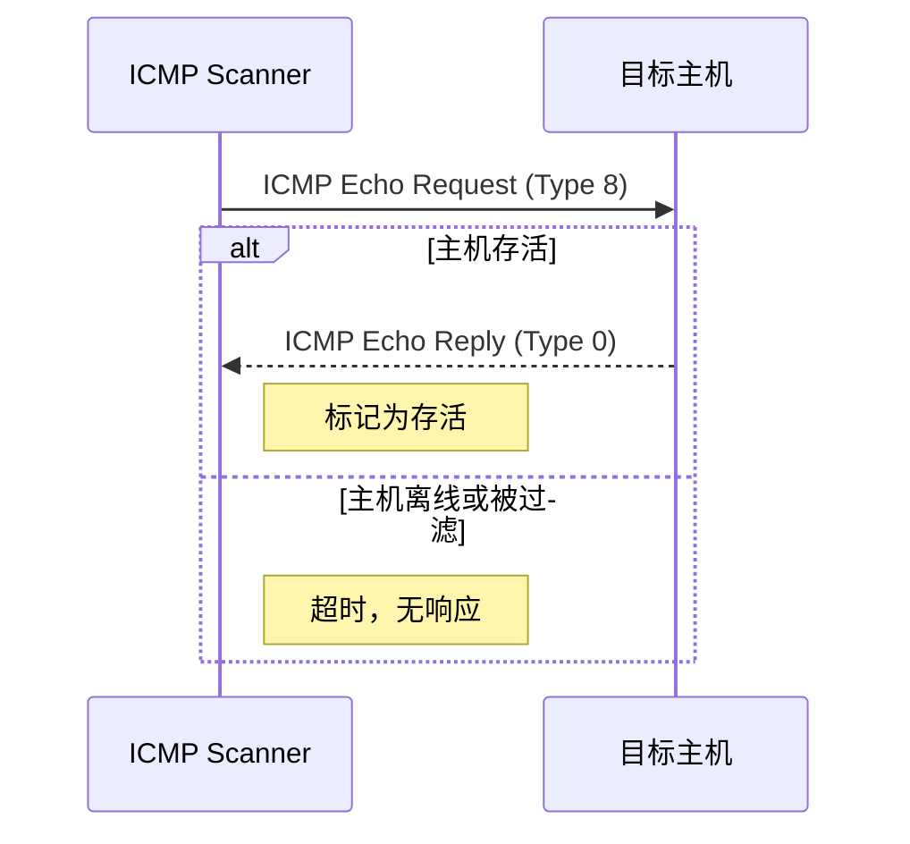
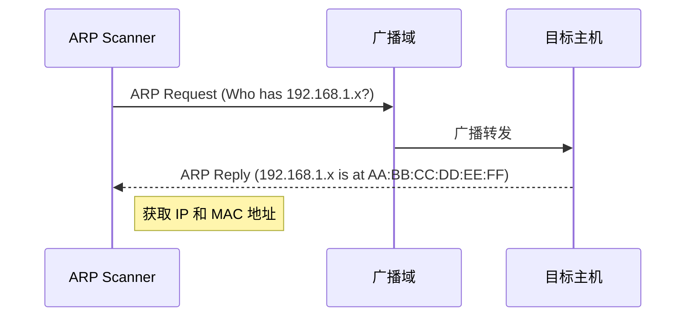
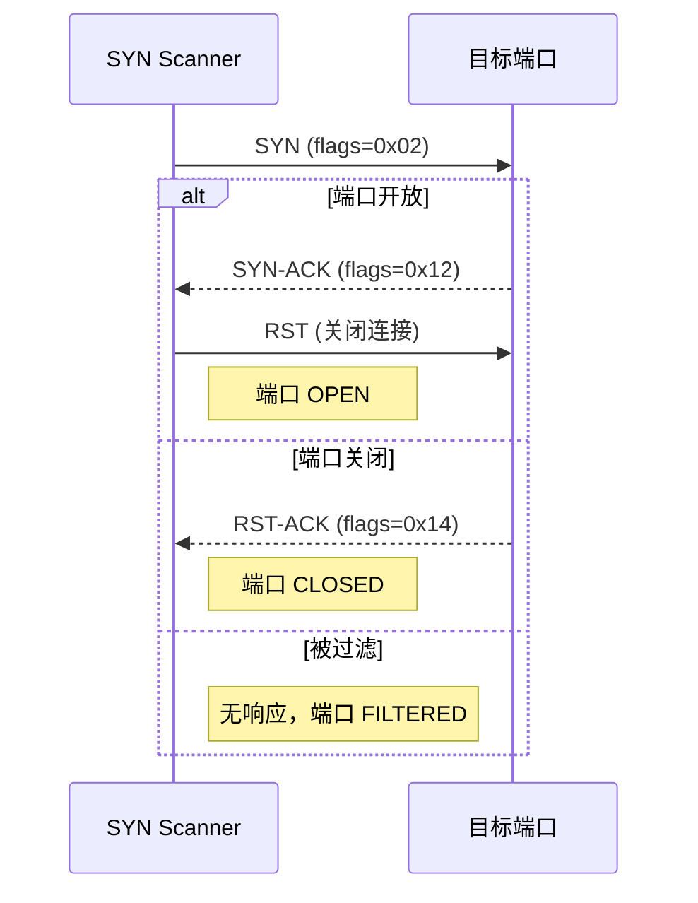
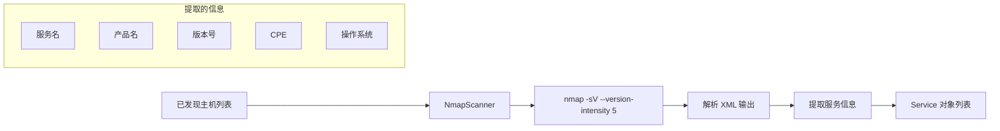

# 扫描器模块

> 理解主机发现和服务识别的实现原理

---

## 模块概述

扫描器模块位于 `src/vulnscan/scanners/`，负责两个核心任务：

1. **主机发现**（Discovery）：找出网络中存活的主机
2. **服务识别**（Service）：识别主机上运行的服务及其版本

```
scanners/
├── __init__.py
├── discovery/              # 主机发现扫描器
│   ├── __init__.py
│   ├── icmp.py            # ICMP Ping 扫描
│   ├── arp.py             # ARP 扫描
│   └── syn.py             # TCP SYN 扫描
└── service/                # 服务识别扫描器
    ├── __init__.py
    └── nmap.py            # Nmap 服务识别
```

---

## 1. 扫描器基类

所有扫描器都继承自 `AssetScanner` 或 `ServiceScanner` 基类（定义在 `core/base.py`）：

```python
class Scanner(ABC):
    @abstractmethod
    def scan(self, context: ScanContext) -> ScanResult:
        """执行扫描并返回结果"""
        pass

    @property
    @abstractmethod
    def name(self) -> str:
        """返回扫描器名称"""
        pass
```

---

## 2. 主机发现扫描器

### 2.1 ICMP 扫描器 (icmp.py)

**原理**：发送 ICMP Echo Request（Ping），根据 Echo Reply 判断主机存活。



**代码实现**：

```python
# src/vulnscan/scanners/discovery/icmp.py:88-111

def _ping_host(self, ip: str) -> Host | None:
    # 构造 ICMP 数据包
    packet = IP(dst=ip) / ICMP()

    # 发送并等待响应
    reply = sr1(packet, timeout=self.timeout, verbose=0)

    if reply and reply.haslayer(ICMP):
        icmp_layer = reply.getlayer(ICMP)
        if icmp_layer.type == 0:  # Echo Reply
            return Host(ip=ip, is_alive=True)

    return None
```

**优缺点**：

| 优点 | 缺点 |
|------|------|
| 速度快 | 可能被防火墙阻挡 |
| 覆盖范围广 | 无法获取 MAC 地址 |
| 实现简单 | 部分主机禁用 ICMP |

**使用场景**：快速扫描公网或未知网络。

---

### 2.2 ARP 扫描器 (arp.py)

**原理**：发送 ARP 广播请求，根据 ARP 响应发现局域网主机。



**代码实现**：

```python
# src/vulnscan/scanners/discovery/arp.py:101-136

def _scan_batch(self, targets: List[str]) -> List[Host]:
    hosts = []

    # 构造 ARP 请求包（广播）
    packets = [
        Ether(dst="ff:ff:ff:ff:ff:ff") / ARP(pdst=ip)
        for ip in targets
    ]

    # 发送并接收响应
    answered, _ = srp(
        packets,
        timeout=self.timeout,
        verbose=0,
        iface=self.interface,
    )

    # 解析响应
    for sent, received in answered:
        if received.haslayer(ARP):
            arp_layer = received.getlayer(ARP)
            host = Host(
                ip=arp_layer.psrc,      # 源 IP
                mac=arp_layer.hwsrc,    # 源 MAC
                is_alive=True,
            )
            hosts.append(host)

    return hosts
```

**优缺点**：

| 优点 | 缺点 |
|------|------|
| 不受防火墙影响 | 仅限同一广播域（局域网） |
| 可获取 MAC 地址 | 无法跨网段扫描 |
| 速度快 | 需要 root 权限 |

**使用场景**：内网资产发现，获取设备 MAC 地址用于资产管理。

---

### 2.3 TCP SYN 扫描器 (syn.py)

**原理**：发送 TCP SYN 包，根据响应判断端口状态。



**代码实现**：

```python
# src/vulnscan/scanners/discovery/syn.py:118-172

def _scan_port(self, ip: str, port: int) -> Service | None:
    # 构造 SYN 包
    src_port = RandShort()  # 随机源端口
    packet = IP(dst=ip) / TCP(sport=src_port, dport=port, flags="S")

    reply = sr1(packet, timeout=self.timeout, verbose=0)

    if reply is None:
        # 无响应 = 被过滤
        return Service(host_ip=ip, port=port, state=PortState.FILTERED)

    if reply.haslayer(TCP):
        tcp_layer = reply.getlayer(TCP)

        if tcp_layer.flags == 0x12:  # SYN-ACK
            # 发送 RST 关闭连接（隐蔽扫描）
            rst = IP(dst=ip) / TCP(sport=src_port, dport=port, flags="R")
            sr1(rst, timeout=0.5, verbose=0)
            return Service(host_ip=ip, port=port, state=PortState.OPEN)

        elif tcp_layer.flags == 0x14:  # RST-ACK
            return Service(host_ip=ip, port=port, state=PortState.CLOSED)

    return None
```

**默认扫描端口**：

```python
DEFAULT_PORTS = [
    21,    # FTP
    22,    # SSH
    23,    # Telnet
    25,    # SMTP
    53,    # DNS
    80,    # HTTP
    110,   # POP3
    135,   # MSRPC
    139,   # NetBIOS
    143,   # IMAP
    443,   # HTTPS
    445,   # SMB
    3306,  # MySQL
    3389,  # RDP
    5432,  # PostgreSQL
    8080,  # HTTP-Alt
    ...
]
```

**优缺点**：

| 优点 | 缺点 |
|------|------|
| 可发现开放端口 | 速度较慢 |
| 隐蔽性好（半开放） | 扫描端口多时耗时长 |
| 准确度高 | 需要 root 权限 |

**使用场景**：需要同时发现主机和端口时使用。

---

### 三种扫描器对比

| 特性 | ICMP | ARP | SYN |
|------|------|-----|-----|
| 速度 | ★★★★★ | ★★★★☆ | ★★★☆☆ |
| 跨网段 | ✅ | ❌ | ✅ |
| 抗防火墙 | ❌ | ✅ | ★★★☆☆ |
| 获取 MAC | ❌ | ✅ | ❌ |
| 发现端口 | ❌ | ❌ | ✅ |
| 权限要求 | root | root | root |

---

## 3. 服务识别扫描器

### 3.1 Nmap 扫描器 (nmap.py)

**原理**：调用系统 Nmap 工具进行服务版本检测。



**代码入口**：

```python
# src/vulnscan/scanners/service/nmap.py:57-98

def scan(self, context: ScanContext) -> ScanResult:
    result = ScanResult()

    # 确定扫描目标
    if context.discovered_services:
        # 扫描特定主机:端口组合
        host_ports = self._group_services_by_host(context.discovered_services)
    elif context.discovered_hosts:
        # 扫描已发现主机的所有端口
        host_ports = {h.ip: None for h in context.discovered_hosts}
    else:
        # 扫描整个目标范围
        hosts = self._scan_range(context.target_range)
        result.hosts.extend(hosts)
        return result

    # 逐主机扫描
    for ip, ports in host_ports.items():
        host_result = self._scan_host(ip, ports)
        result.hosts.extend(host_result.hosts)
        result.services.extend(host_result.services)

    return result
```

**单主机扫描**：

```python
# src/vulnscan/scanners/service/nmap.py:100-148

def _scan_host(self, ip: str, ports: List[int] = None) -> ScanResult:
    result = ScanResult()

    # 构建 Nmap 参数
    args = self._build_arguments(ports)

    # 执行扫描
    self._nm.scan(hosts=ip, arguments=args)

    if ip in self._nm.all_hosts():
        host_data = self._nm[ip]

        # 创建主机对象
        host = Host(
            ip=ip,
            hostname=self._get_hostname(host_data),
            os_guess=self._get_os_guess(host_data),
            is_alive=True,
        )
        result.hosts.append(host)

        # 解析 TCP 端口
        if "tcp" in host_data:
            for port, port_data in host_data["tcp"].items():
                service = self._parse_service(ip, port, "tcp", port_data)
                if service:
                    result.services.append(service)

        # 解析 UDP 端口
        if "udp" in host_data:
            for port, port_data in host_data["udp"].items():
                service = self._parse_service(ip, port, "udp", port_data)
                if service:
                    result.services.append(service)

    return result
```

**Nmap 参数说明**：

| 参数 | 含义 |
|------|------|
| `-sV` | 服务版本检测 |
| `--version-intensity 5` | 版本检测强度（0-9） |
| `-sn` | 仅主机发现，不扫描端口 |
| `-O` | 操作系统检测 |
| `-p 1-1024` | 指定端口范围 |

**服务解析输出**：

```python
# Nmap 返回的数据结构
port_data = {
    "state": "open",
    "name": "http",           # 服务名
    "product": "Apache",       # 产品名
    "version": "2.4.52",       # 版本号
    "cpe": "cpe:/a:apache:http_server:2.4.52",  # CPE 标识
}

# 转换为 Service 对象
service = Service(
    host_ip="192.168.1.1",
    port=80,
    proto="tcp",
    service_name="http",
    product="Apache",
    version="2.4.52",
    cpe="cpe:/a:apache:http_server:2.4.52",
    state=PortState.OPEN,
)
```

---

## 4. 目标解析

所有扫描器都支持多种目标格式：

```python
# src/vulnscan/scanners/discovery/icmp.py:113-150

def _parse_targets(self, target_range: str) -> List[str]:
    """
    解析目标范围为 IP 地址列表

    支持格式：
    - 单个 IP：192.168.1.1
    - CIDR：192.168.1.0/24
    - 范围：192.168.1.1-192.168.1.254
    - 简写范围：192.168.1.1-254
    """
```

**示例**：

| 输入 | 解析结果 |
|------|----------|
| `192.168.1.1` | `['192.168.1.1']` |
| `192.168.1.0/24` | `['192.168.1.1', '192.168.1.2', ..., '192.168.1.254']` |
| `192.168.1.1-10` | `['192.168.1.1', '192.168.1.2', ..., '192.168.1.10']` |
| `192.168.1.1-192.168.1.10` | `['192.168.1.1', ..., '192.168.1.10']` |

---

## 5. 并发扫描

所有扫描器都支持多线程并发，提高扫描效率：

```python
# 配置来源：config.py
max_threads = config.scan.max_threads  # 默认 50

# 并发执行示例（来自 icmp.py）
with ThreadPoolExecutor(max_workers=self.max_threads) as executor:
    futures = {
        executor.submit(self._ping_host, ip): ip
        for ip in targets
    }

    for future in as_completed(futures):
        ip = futures[future]
        try:
            host = future.result()
            if host:
                hosts.append(host)
        except Exception as e:
            logger.warning(f"Error scanning {ip}: {e}")
```

---

## 6. 使用示例

### 在流水线中使用

```python
from vulnscan.scanners import ICMPScanner, ARPScanner, NmapScanner
from vulnscan.core.base import ScanContext

# 创建上下文
context = ScanContext(target_range="192.168.1.0/24", scan_id=1)

# 阶段 1：主机发现
icmp_scanner = ICMPScanner(timeout=2.0)
discovery_result = icmp_scanner.scan(context)
print(f"发现 {len(discovery_result.hosts)} 台存活主机")

# 更新上下文
context = context.with_hosts(discovery_result.hosts)

# 阶段 2：服务识别
nmap_scanner = NmapScanner()
service_result = nmap_scanner.scan(context)
print(f"识别 {len(service_result.services)} 个服务")
```

### 直接使用扫描器

```python
# ARP 扫描获取 MAC 地址
arp_scanner = ARPScanner(interface="eth0")
result = arp_scanner.scan(context)
for host in result.hosts:
    print(f"{host.ip} -> {host.mac}")

# SYN 扫描指定端口
syn_scanner = SYNScanner(ports=[22, 80, 443, 3306])
result = syn_scanner.scan(context)
for svc in result.services:
    if svc.state == PortState.OPEN:
        print(f"{svc.host_ip}:{svc.port} is open")
```

---

## 7. 代码位置速查

| 功能 | 文件 | 关键方法 |
|------|------|----------|
| ICMP 扫描 | `scanners/discovery/icmp.py` | `ICMPScanner._ping_host()` |
| ARP 扫描 | `scanners/discovery/arp.py` | `ARPScanner._scan_batch()` |
| SYN 扫描 | `scanners/discovery/syn.py` | `SYNScanner._scan_port()` |
| Nmap 服务识别 | `scanners/service/nmap.py` | `NmapScanner._scan_host()` |
| 目标解析 | `scanners/discovery/icmp.py` | `_parse_targets()` |

---

## 下一步

- [NVD 漏洞库集成](03_nvd.md) - 了解如何匹配 CVE 漏洞
- [核心模块](01_core.md) - 回顾数据模型定义
- [主动验证模块](05_verifiers.md) - 了解弱密码检测等验证功能
