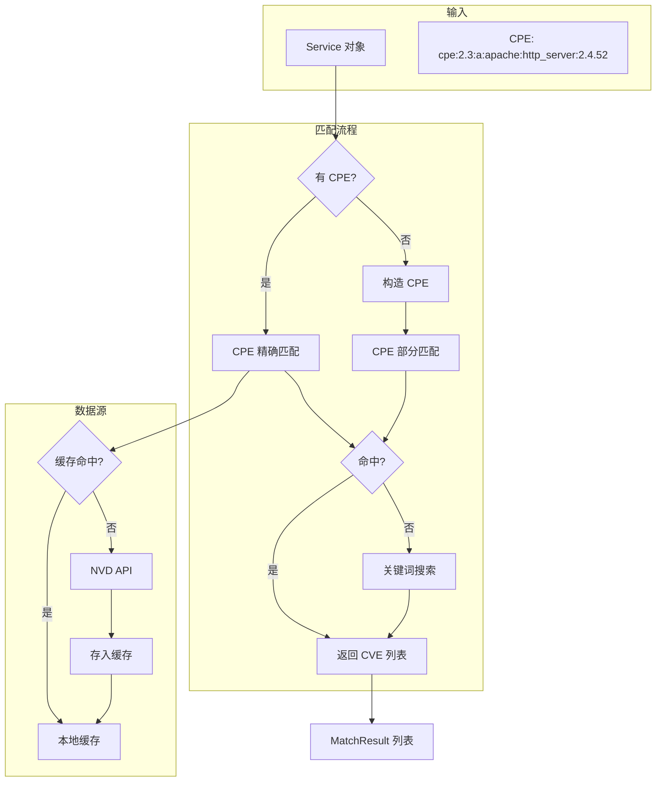
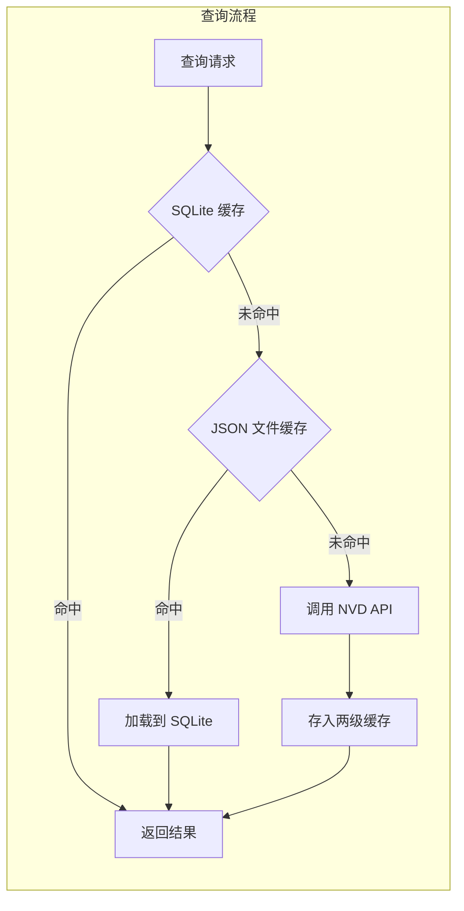
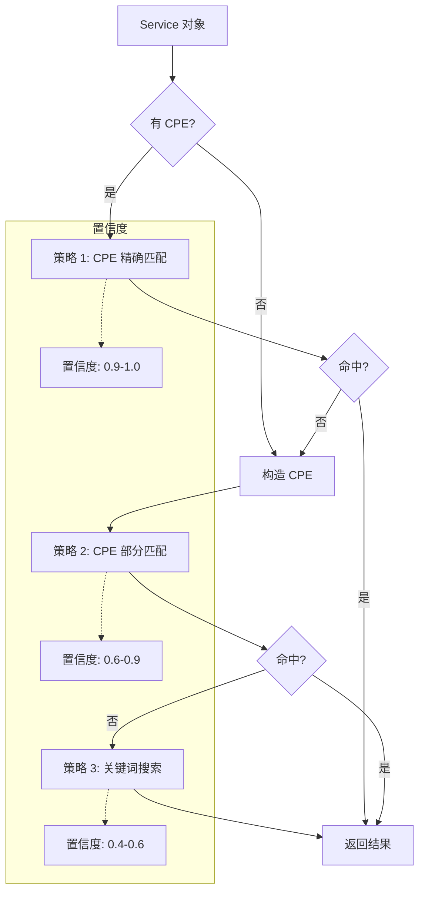

# NVD 漏洞库集成

> 理解如何从国家漏洞数据库获取和匹配 CVE 漏洞

---

## 模块概述

NVD 模块位于 `src/vulnscan/nvd/`，负责与 NVD（National Vulnerability Database，国家漏洞数据库）交互：

```
nvd/
├── __init__.py
├── client.py              # NVD API 客户端
├── cache.py               # 本地缓存
├── matcher.py             # 漏洞匹配器
└── feeds.py               # 离线数据同步
```

---

## 1. 整体流程



---

## 2. NVD API 客户端 (client.py)

### 2.1 NVDClient 类

```python
# src/vulnscan/nvd/client.py:42-79

class NVDClient:
    """
    NVD API 2.0 客户端

    支持的搜索方式：
    - CPE 名称
    - 关键词
    - CVE ID
    - 日期范围
    - 严重程度
    """

    BASE_URL = "https://services.nvd.nist.gov/rest/json/cves/2.0"

    def __init__(self, api_key: str = None, rate_limit: float = None):
        self.api_key = api_key or config.nvd.api_key
        # API Key 可提升速率限制
        # 有 API Key: ~1.5 req/s
        # 无 API Key: ~0.15 req/s
```

### 2.2 速率限制

NVD API 有严格的速率限制，客户端使用令牌桶算法控制请求频率：

```python
# src/vulnscan/nvd/client.py:19-39

class RateLimiter:
    """令牌桶速率限制器"""

    def __init__(self, rate: float):
        self.rate = rate              # 每秒请求数
        self.interval = 1.0 / rate    # 请求间隔
        self.last_request = 0.0

    def wait(self) -> None:
        """等待直到允许下一次请求"""
        now = time.time()
        elapsed = now - self.last_request
        if elapsed < self.interval:
            time.sleep(self.interval - elapsed)
        self.last_request = time.time()
```

**速率限制对照**：

| 条件 | 限制 | 换算 |
|------|------|------|
| 无 API Key | 5 请求/30秒 | ~0.17 请求/秒 |
| 有 API Key | 50 请求/30秒 | ~1.67 请求/秒 |

### 2.3 搜索方法

#### 按 CPE 搜索

```python
# src/vulnscan/nvd/client.py:80-103

def search_by_cpe(
    self,
    cpe_name: str,
    results_per_page: int = 100,
    start_index: int = 0,
) -> List[Vulnerability]:
    """
    搜索影响特定 CPE 的 CVE

    Args:
        cpe_name: CPE 2.3 格式字符串
        results_per_page: 每页结果数（最大 2000）
        start_index: 分页起始索引
    """
    params = {
        "cpeName": cpe_name,
        "resultsPerPage": results_per_page,
        "startIndex": start_index,
    }
    return self._search(params)
```

#### 按关键词搜索

```python
# src/vulnscan/nvd/client.py:105-130

def search_by_keyword(
    self,
    keyword: str,
    exact_match: bool = False,
    results_per_page: int = 100,
) -> List[Vulnerability]:
    """
    按关键词搜索 CVE

    Args:
        keyword: 搜索关键词（如 "Apache 2.4.52"）
        exact_match: 是否精确匹配
    """
    params = {
        "keywordSearch": keyword,
        "resultsPerPage": results_per_page,
    }
    if exact_match:
        params["keywordExactMatch"] = ""
    return self._search(params)
```

#### 按 CVE ID 获取

```python
# src/vulnscan/nvd/client.py:132-144

def get_cve(self, cve_id: str) -> Optional[Vulnerability]:
    """
    获取特定 CVE

    Args:
        cve_id: CVE 编号（如 CVE-2021-44228）
    """
    params = {"cveId": cve_id}
    results = self._search(params)
    return results[0] if results else None
```

#### 按日期范围搜索

```python
# src/vulnscan/nvd/client.py:146-178

def search_by_date_range(
    self,
    pub_start: datetime = None,   # 发布日期开始
    pub_end: datetime = None,     # 发布日期结束
    mod_start: datetime = None,   # 修改日期开始
    mod_end: datetime = None,     # 修改日期结束
) -> List[Vulnerability]:
    """按发布或修改日期搜索 CVE"""
```

#### 按严重程度搜索

```python
# src/vulnscan/nvd/client.py:180-202

def search_by_severity(
    self,
    severity: str,           # CRITICAL, HIGH, MEDIUM, LOW
    cvss_version: str = "V3",
) -> List[Vulnerability]:
    """按 CVSS 严重程度搜索 CVE"""
```

---

## 3. 本地缓存 (cache.py)

### 3.1 双层缓存架构



### 3.2 CVECache 类

```python
# src/vulnscan/nvd/cache.py

class CVECache:
    """CVE 本地缓存"""

    def get(self, cve_id: str) -> Optional[Vulnerability]:
        """
        获取单个 CVE

        查询顺序：
        1. SQLite 数据库
        2. JSON 文件缓存
        """
        # 先查数据库
        vuln = self.repo.get_by_cve(cve_id)
        if vuln:
            return vuln

        # 再查文件缓存
        return self._get_from_file(cve_id)

    def get_by_cpe(self, cpe: str) -> List[Vulnerability]:
        """获取影响特定 CPE 的所有 CVE"""
        return self.repo.search_by_cpe(cpe)

    def put(self, vuln: Vulnerability) -> None:
        """存储 CVE 到缓存"""
        self.repo.upsert(vuln)        # 存入数据库
        self._save_to_file(vuln)       # 存入文件

    def put_many(self, vulns: List[Vulnerability]) -> None:
        """批量存储"""
        for vuln in vulns:
            self.put(vuln)
```

### 3.3 缓存新鲜度检查

```python
def is_fresh(self, cpe: str, max_age_days: int = 7) -> bool:
    """
    检查 CPE 的缓存是否新鲜

    Args:
        cpe: CPE 标识符
        max_age_days: 最大缓存年龄（天）
    """
    meta = self._get_meta(cpe)
    if not meta:
        return False
    age = datetime.now() - meta.last_updated
    return age.days < max_age_days
```

---

## 4. 漏洞匹配器 (matcher.py)

### 4.1 匹配策略

匹配器使用三层策略，按优先级递减：



### 4.2 MatchResult 数据结构

```python
# src/vulnscan/nvd/matcher.py:17-24

@dataclass
class MatchResult:
    """漏洞匹配结果"""
    vulnerability: Vulnerability  # 匹配到的漏洞
    service: Service              # 被匹配的服务
    match_type: str               # 匹配类型
    confidence: float             # 置信度 (0.0 - 1.0)
```

**匹配类型**：

| match_type | 说明 | 置信度 |
|------------|------|--------|
| `cpe_exact` | CPE 完全匹配 | 0.9-1.0 |
| `cpe_partial` | CPE 部分匹配（厂商+产品） | 0.6-0.9 |
| `keyword` | 关键词搜索匹配 | 0.4-0.6 |

### 4.3 VulnerabilityMatcher 类

```python
# src/vulnscan/nvd/matcher.py:26-95

class VulnerabilityMatcher:
    """漏洞匹配器"""

    def __init__(self, client: NVDClient = None, cache: CVECache = None):
        self.client = client or NVDClient()
        self.cache = cache or CVECache()

    def match_service(self, service: Service) -> List[MatchResult]:
        """
        匹配单个服务的漏洞

        策略顺序：
        1. CPE 精确匹配
        2. 构造 CPE 部分匹配
        3. 关键词搜索
        """
        results = []

        # 策略 1: CPE 精确匹配
        if service.cpe:
            cpe_results = self._match_by_cpe(service, service.cpe)
            results.extend(cpe_results)

        # 策略 2: 构造 CPE 部分匹配
        if not results and service.product:
            guessed_cpe = self._guess_cpe(service)
            if guessed_cpe:
                cpe_results = self._match_by_cpe(
                    service, guessed_cpe, partial=True
                )
                results.extend(cpe_results)

        # 策略 3: 关键词搜索
        if not results and service.product:
            keyword_results = self._match_by_keyword(service)
            results.extend(keyword_results)

        return results

    def match_services(self, services: List[Service]) -> List[MatchResult]:
        """批量匹配多个服务"""
        all_results = []
        for service in services:
            results = self.match_service(service)
            all_results.extend(results)
        return all_results
```

### 4.4 CPE 匹配实现

```python
# src/vulnscan/nvd/matcher.py:96-140

def _match_by_cpe(
    self,
    service: Service,
    cpe: str,
    partial: bool = False,
) -> List[MatchResult]:
    """
    按 CPE 匹配漏洞

    Args:
        service: 被匹配的服务
        cpe: CPE 字符串
        partial: 是否为部分/猜测的 CPE
    """
    results = []

    # 先查缓存
    vulns = self.cache.get_by_cpe(cpe)

    # 缓存未命中则查询 API
    if not vulns:
        vulns = self.client.search_by_cpe(cpe)
        self.cache.put_many(vulns)

    # 计算置信度
    for vuln in vulns:
        confidence = self._calculate_confidence(service, vuln, partial)
        results.append(MatchResult(
            vulnerability=vuln,
            service=service,
            match_type="cpe_partial" if partial else "cpe_exact",
            confidence=confidence,
        ))

    return results
```

### 4.5 关键词匹配实现

```python
# src/vulnscan/nvd/matcher.py:141-176

def _match_by_keyword(self, service: Service) -> List[MatchResult]:
    """
    按关键词匹配漏洞

    使用产品名 + 版本号作为搜索关键词
    """
    results = []

    # 构建搜索关键词
    keyword = service.product
    if service.version:
        keyword = f"{service.product} {service.version}"

    # 搜索 NVD
    vulns = self.client.search_by_keyword(keyword)

    for vuln in vulns:
        # 按版本号过滤
        if service.version and vuln.description:
            if not self._description_mentions_version(
                vuln.description, service.version
            ):
                continue

        results.append(MatchResult(
            vulnerability=vuln,
            service=service,
            match_type="keyword",
            confidence=0.5,  # 关键词匹配置信度较低
        ))

    return results
```

### 4.6 置信度计算

置信度反映匹配的可靠程度：

```python
def _calculate_confidence(
    self,
    service: Service,
    vuln: Vulnerability,
    partial: bool,
) -> float:
    """
    计算匹配置信度

    影响因素：
    1. 匹配类型（精确/部分）
    2. 版本号匹配程度
    3. 厂商匹配程度
    """
    base = 0.7 if partial else 0.9

    # 版本号完全匹配加分
    if service.version and vuln.affected_cpe:
        if service.version in vuln.affected_cpe:
            base += 0.1

    return min(base, 1.0)
```

---

## 5. 离线数据同步 (feeds.py)

### 5.1 NVD 数据源类型

```python
class FeedType(Enum):
    MODIFIED = "modified"   # 最近修改的 CVE
    RECENT = "recent"       # 最近发布的 CVE
    YEARLY = "yearly"       # 年度数据包
```

### 5.2 FeedDownloader 类

用于下载 NVD 离线数据包：

```python
# src/vulnscan/nvd/feeds.py:115-160

class FeedDownloader:
    """NVD 数据包下载器"""

    # 可用年份范围
    AVAILABLE_YEARS = range(2002, datetime.now().year + 1)

    def download_feed(self, year: int, force: bool = False) -> FeedMeta:
        """
        下载指定年份的数据包

        Args:
            year: 年份 (2002 - 当前年)
            force: 强制重新下载

        Returns:
            FeedMeta 包含下载信息
        """
        url = self.get_feed_url(year)
        local_path = self.cache_dir / f"nvdcve-1.1-{year}.json.gz"

        # 检查是否已下载
        if local_path.exists() and not force:
            return FeedMeta(...)

        # 下载数据包
        ...
```

### 5.3 FeedParser 类

解析下载的数据包：

```python
class FeedParser:
    """NVD 数据包解析器"""

    def parse_feed(self, path: Path, batch_size: int = 1000):
        """
        流式解析数据包

        Args:
            path: 数据包路径
            batch_size: 每批处理的 CVE 数量

        Yields:
            List[Vulnerability] 批次
        """
```

### 5.4 HybridSyncCoordinator 类

协调离线和在线数据同步：

```python
# src/vulnscan/nvd/feeds.py:422-548

class HybridSyncCoordinator:
    """
    混合同步协调器

    策略：
    1. 首次同步：下载离线数据包（多年份）
    2. 增量同步：调用 API 获取最近 7 天更新
    """

    INCREMENTAL_DAYS = 7
    DEFAULT_YEARS = list(range(2020, datetime.now().year + 1))

    def full_sync(
        self,
        years: List[int] = None,
        progress_callback = None,
    ) -> SyncResult:
        """
        全量同步

        下载并导入指定年份的数据包
        """
        years = years or self.DEFAULT_YEARS
        result = SyncResult()

        for year in years:
            # 下载数据包
            feed = self.downloader.download_feed(year)

            # 解析并导入
            for batch in self.parser.parse_feed(feed.local_path):
                for vuln in batch:
                    existing = self.vuln_repo.get_by_cve(vuln.cve_id)
                    if existing:
                        self.vuln_repo.update(vuln)
                        result.cves_updated += 1
                    else:
                        self.vuln_repo.create(vuln)
                        result.cves_added += 1

            if progress_callback:
                progress_callback(f"Imported {year}: {count} CVEs")

        return result

    def incremental_sync(self) -> SyncResult:
        """
        增量同步

        仅获取最近 7 天的更新
        """
        end_date = datetime.now()
        start_date = end_date - timedelta(days=self.INCREMENTAL_DAYS)

        vulns = self.client.search_by_date_range(
            mod_start=start_date,
            mod_end=end_date,
        )

        # 更新本地数据库
        ...
```

---

## 6. CPE 格式说明

### CPE 2.3 格式

```
cpe:2.3:<part>:<vendor>:<product>:<version>:<update>:<edition>:<language>:<sw_edition>:<target_sw>:<target_hw>:<other>
```

**字段说明**：

| 字段 | 含义 | 示例 |
|------|------|------|
| part | 类型 | a (应用), o (操作系统), h (硬件) |
| vendor | 厂商 | apache, microsoft |
| product | 产品 | http_server, windows |
| version | 版本 | 2.4.52, 10 |
| update | 更新版本 | sp1, * |
| * | 通配符 | 匹配任意值 |

**示例**：

```
# Apache HTTP Server 2.4.52
cpe:2.3:a:apache:http_server:2.4.52:*:*:*:*:*:*:*

# OpenSSH 8.0
cpe:2.3:a:openbsd:openssh:8.0:*:*:*:*:*:*:*

# Microsoft Windows 10
cpe:2.3:o:microsoft:windows_10:-:*:*:*:*:*:*:*
```

---

## 7. 使用示例

### 匹配单个服务

```python
from vulnscan.nvd import VulnerabilityMatcher
from vulnscan.core.models import Service

# 创建服务对象
service = Service(
    host_ip="192.168.1.1",
    port=80,
    service_name="http",
    product="Apache",
    version="2.4.52",
    cpe="cpe:2.3:a:apache:http_server:2.4.52:*:*:*:*:*:*:*",
)

# 匹配漏洞
matcher = VulnerabilityMatcher()
results = matcher.match_service(service)

for result in results:
    print(f"CVE: {result.vulnerability.cve_id}")
    print(f"CVSS: {result.vulnerability.cvss_base}")
    print(f"置信度: {result.confidence}")
```

### 同步漏洞数据库

```python
from vulnscan.nvd import HybridSyncCoordinator

# 首次全量同步
coordinator = HybridSyncCoordinator()
result = coordinator.full_sync(
    years=[2020, 2021, 2022, 2023, 2024],
    progress_callback=lambda msg: print(msg),
)
print(f"新增: {result.cves_added}, 更新: {result.cves_updated}")

# 后续增量同步
result = coordinator.incremental_sync()
```

---

## 8. 代码位置速查

| 功能 | 文件 | 关键类/方法 |
|------|------|------------|
| API 客户端 | `nvd/client.py` | `NVDClient.search_by_cpe()` |
| 速率限制 | `nvd/client.py` | `RateLimiter.wait()` |
| 本地缓存 | `nvd/cache.py` | `CVECache.get()`, `.put()` |
| 漏洞匹配 | `nvd/matcher.py` | `VulnerabilityMatcher.match_service()` |
| 离线同步 | `nvd/feeds.py` | `HybridSyncCoordinator.full_sync()` |

---

## 下一步

- [风险评分模块](04_scoring.md) - 了解如何计算风险评分
- [扫描器模块](02_scanners.md) - 回顾服务识别如何获取 CPE
- [数据存储模块](08_storage.md) - 了解 CVE 如何存储在数据库
