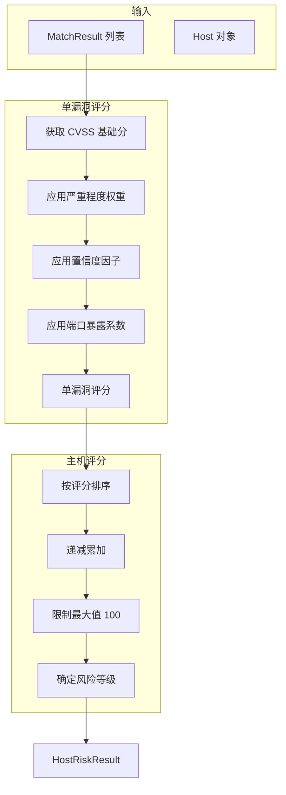

# 风险评分模块

> 理解漏洞风险量化算法的实现原理

---

## 模块概述

风险评分模块位于 `src/vulnscan/core/scoring.py`，负责将发现的漏洞转化为可量化的风险评分。

**设计目标**：

- 综合考量漏洞危害性、匹配可信度、服务暴露度
- 避免简单线性累加导致的评分失真
- 支持单漏洞场景下的合理风险定级

---

## 1. 核心公式

### 单漏洞评分

```
VulnScore = CVSS × CVSSWeight × SeverityWeight × ConfidenceFactor × PortExposure
```

### 主机总评分

```
HostScore = Σ(VulnScoreᵢ × DecayFactorⁱ)    // i 从 0 开始递减累加
```

---

## 2. 评分流程



---

## 3. 四大量化维度

### 3.1 基础危害性 (CVSS)

直接使用 NVD 提供的 CVSS 基础分（0-10 分）。

```python
# src/vulnscan/core/scoring.py:212-216

cvss = vuln.cvss_base or 0.0
score = cvss * self.config.cvss_weight  # 默认权重 1.0
```

### 3.2 严重程度权重 (Severity Weight)

根据 CVSS 分数映射的严重程度，应用非线性放大系数：

```python
# src/vulnscan/core/scoring.py:44-50

SEVERITY_WEIGHTS = {
    Severity.CRITICAL: 4.0,   # CVSS >= 9.0
    Severity.HIGH: 3.0,       # CVSS >= 7.0
    Severity.MEDIUM: 1.5,     # CVSS >= 4.0
    Severity.LOW: 0.5,        # CVSS < 4.0
}
```

**设计意图**：严重漏洞应获得更高权重，不能与低危漏洞等同对待。

**示例**：

| 漏洞 | CVSS | 严重程度 | 权重 | 加权分 |
|------|------|----------|------|--------|
| CVE-A | 9.8 | CRITICAL | 4.0 | 39.2 |
| CVE-B | 7.5 | HIGH | 3.0 | 22.5 |
| CVE-C | 5.0 | MEDIUM | 1.5 | 7.5 |
| CVE-D | 3.0 | LOW | 0.5 | 1.5 |

### 3.3 匹配置信度因子 (Confidence Factor)

反映 CVE 与服务匹配的可靠程度。使用**二次缓冲曲线**减轻低置信度的惩罚：

```python
# src/vulnscan/core/scoring.py:223-226

# 公式: factor = confidence * (2.0 - confidence)
# 0.5 置信度 -> 0.75 因子
# 0.8 置信度 -> 0.96 因子
# 1.0 置信度 -> 1.0 因子
confidence_factor = match.confidence * (2.0 - match.confidence)
score *= confidence_factor
```

**曲线特性**：

```
置信度    线性因子    二次缓冲因子
0.3       0.30        0.51
0.5       0.50        0.75
0.7       0.70        0.91
0.9       0.90        0.99
1.0       1.00        1.00
```

**设计意图**：即使匹配不确定，也应保留较大比例的风险分数。

### 3.4 端口暴露系数 (Port Exposure)

高危端口上的漏洞风险更大：

```python
# src/vulnscan/core/scoring.py:22-42

HIGH_RISK_PORTS = {
    21: 1.2,    # FTP - 明文传输
    22: 1.3,    # SSH - 暴力破解目标
    23: 1.5,    # Telnet - 明文传输
    25: 1.1,    # SMTP - 邮件中继
    53: 1.2,    # DNS - DNS 劫持
    135: 1.4,   # MS RPC - 远程代码执行
    139: 1.4,   # NetBIOS - 信息泄露
    445: 1.5,   # SMB - 勒索软件传播
    1433: 1.4,  # MSSQL - 数据库攻击
    3306: 1.3,  # MySQL - 数据库攻击
    3389: 1.5,  # RDP - 远程桌面攻击
    5432: 1.3,  # PostgreSQL - 数据库攻击
    5900: 1.4,  # VNC - 远程控制
    6379: 1.3,  # Redis - 未授权访问
    27017: 1.3, # MongoDB - 未授权访问
}
```

**应用方式**：

```python
# src/vulnscan/core/scoring.py:134-136

if self.config.port_exposure_enabled:
    port_factor = HIGH_RISK_PORTS.get(match.service.port, 1.0)
    base_score *= port_factor
```

---

## 4. 多漏洞递减累加

避免评分膨胀，使用递减因子：

```python
# src/vulnscan/core/scoring.py:230-256

def _aggregate_scores(self, scores: List[float]) -> float:
    if not scores:
        return 0.0

    # 按评分降序排列
    sorted_scores = sorted(scores, reverse=True)

    total = 0.0
    factor = 1.0

    for score in sorted_scores:
        total += score * factor
        factor *= self.config.accumulation_factor  # 默认 0.8

    # 限制最大分数
    return min(total, self.config.max_score)  # 默认 100
```

**示例**：3 个漏洞评分 [30, 20, 10]

```
第 1 个: 30 × 1.0    = 30.0
第 2 个: 20 × 0.8    = 16.0
第 3 个: 10 × 0.64   = 6.4
总分: 30 + 16 + 6.4  = 52.4
```

**设计意图**：首个高危漏洞影响最大，后续漏洞边际效应递减。

---

## 5. 风险等级阈值

```python
# src/vulnscan/core/scoring.py:68-72

critical_threshold: float = 25.0  # >= 25 为 CRITICAL
high_threshold: float = 12.0      # >= 12 为 HIGH
medium_threshold: float = 5.0     # >= 5 为 MEDIUM
# < 5 且 > 0 为 LOW
# = 0 为 INFO
```

**等级对照表**：

| 评分范围 | 风险等级 | 含义 |
|----------|----------|------|
| >= 25 | CRITICAL | 需立即处理 |
| 12 - 24.9 | HIGH | 高优先级修复 |
| 5 - 11.9 | MEDIUM | 计划修复 |
| 0.1 - 4.9 | LOW | 低优先级 |
| 0 | INFO | 无已知漏洞 |

**典型场景**：

| 场景 | 预估评分 | 等级 |
|------|----------|------|
| 1 个 CRITICAL 漏洞 (CVSS 9.5) | 9.5 × 4.0 = 38 | CRITICAL |
| 1 个 HIGH 漏洞 (CVSS 7.5) | 7.5 × 3.0 = 22.5 | HIGH |
| 1 个 MEDIUM 漏洞 (CVSS 5.0) | 5.0 × 1.5 = 7.5 | MEDIUM |
| 3 个 LOW 漏洞 (CVSS 3.0) | 1.5 + 1.2 + 0.96 ≈ 3.7 | LOW |

---

## 6. 核心类

### 6.1 RiskConfig - 评分配置

```python
# src/vulnscan/core/scoring.py:53-72

@dataclass
class RiskConfig:
    cvss_weight: float = 1.0           # CVSS 权重
    port_exposure_enabled: bool = True # 启用端口暴露系数
    accumulation_factor: float = 0.8   # 递减累加因子
    max_score: float = 100.0           # 最高分数
    critical_threshold: float = 25.0   # CRITICAL 阈值
    high_threshold: float = 12.0       # HIGH 阈值
    medium_threshold: float = 5.0      # MEDIUM 阈值
```

### 6.2 RiskScorer - 评分器

```python
# src/vulnscan/core/scoring.py:74-93

class RiskScorer:
    """
    计算主机风险评分

    考虑因素：
    - CVSS 基础分
    - 严重程度权重
    - 端口暴露系数
    - 漏洞累加效应
    """

    def __init__(self, config: RiskConfig = None):
        self.config = config or RiskConfig()
```

### 6.3 主要方法

#### score_host() - 评估单个主机

```python
# src/vulnscan/core/scoring.py:94-166

def score_host(
    self,
    host: Host,
    services: List[Service],
    matches: List[MatchResult],
) -> HostRiskResult:
    """
    计算单个主机的风险评分

    Args:
        host: 目标主机
        services: 主机上的服务
        matches: 漏洞匹配结果

    Returns:
        HostRiskResult 包含评分和统计
    """
```

#### score_hosts() - 批量评估

```python
# src/vulnscan/core/scoring.py:168-195

def score_hosts(
    self,
    hosts: List[Host],
    services: List[Service],
    matches: List[MatchResult],
) -> List[HostRiskResult]:
    """
    批量计算多个主机的风险评分

    返回结果按评分降序排列
    """
```

---

## 7. 辅助函数

### calculate_scan_risk_summary() - 扫描摘要

```python
# src/vulnscan/core/scoring.py:317-360

def calculate_scan_risk_summary(results: List[HostRiskResult]) -> Dict:
    """
    计算整体扫描风险摘要

    Returns:
        {
            "total_hosts": 10,           # 总主机数
            "total_vulnerabilities": 45, # 总漏洞数
            "average_score": 15.5,       # 平均评分
            "max_score": 52.4,           # 最高评分
            "critical_hosts": 2,         # CRITICAL 主机数
            "high_hosts": 3,             # HIGH 主机数
            "medium_hosts": 4,           # MEDIUM 主机数
            "low_hosts": 1,              # LOW 主机数
            "info_hosts": 0,             # INFO 主机数
        }
    """
```

---

## 8. 使用示例

### 基本用法

```python
from vulnscan.core.scoring import RiskScorer, RiskConfig
from vulnscan.nvd.matcher import VulnerabilityMatcher

# 使用默认配置
scorer = RiskScorer()

# 计算主机评分
result = scorer.score_host(host, services, matches)
print(f"评分: {result.risk_score}")
print(f"等级: {result.risk_level.value}")
print(f"摘要: {result.summary}")
```

### 自定义配置

```python
# 更严格的配置
strict_config = RiskConfig(
    cvss_weight=1.2,            # 放大 CVSS 影响
    accumulation_factor=0.7,    # 更快的递减
    critical_threshold=20.0,    # 更低的 CRITICAL 阈值
    high_threshold=10.0,        # 更低的 HIGH 阈值
)

scorer = RiskScorer(config=strict_config)
```

### 批量评估

```python
# 评估所有主机
results = scorer.score_hosts(hosts, services, matches)

# 按评分排序（默认已排序）
for result in results:
    print(f"{result.host_id}: {result.risk_score} ({result.risk_level.value})")

# 获取扫描摘要
from vulnscan.core.scoring import calculate_scan_risk_summary
summary = calculate_scan_risk_summary(results)
print(f"高危主机: {summary['critical_hosts']} 台")
```

---

## 9. 完整评分示例

假设一台主机有以下漏洞：

| CVE | CVSS | 严重程度 | 置信度 | 端口 |
|-----|------|----------|--------|------|
| CVE-2021-44228 | 10.0 | CRITICAL | 0.9 | 8080 |
| CVE-2022-22965 | 9.8 | CRITICAL | 0.7 | 8080 |
| CVE-2023-12345 | 7.5 | HIGH | 0.8 | 22 |

**计算过程**：

```
CVE-2021-44228:
  基础: 10.0 × 1.0 = 10.0
  严重程度: 10.0 × 4.0 = 40.0
  置信度: 40.0 × (0.9 × 1.1) = 40.0 × 0.99 = 39.6
  端口: 39.6 × 1.0 = 39.6

CVE-2022-22965:
  基础: 9.8 × 1.0 = 9.8
  严重程度: 9.8 × 4.0 = 39.2
  置信度: 39.2 × (0.7 × 1.3) = 39.2 × 0.91 = 35.7
  端口: 35.7 × 1.0 = 35.7

CVE-2023-12345:
  基础: 7.5 × 1.0 = 7.5
  严重程度: 7.5 × 3.0 = 22.5
  置信度: 22.5 × (0.8 × 1.2) = 22.5 × 0.96 = 21.6
  端口 (SSH): 21.6 × 1.3 = 28.1

递减累加（按评分排序）:
  39.6 × 1.0 = 39.6
  35.7 × 0.8 = 28.6
  28.1 × 0.64 = 18.0

总分: 39.6 + 28.6 + 18.0 = 86.2
等级: CRITICAL (>= 25)
```

---

## 10. 代码位置速查

| 功能 | 文件 | 行号 |
|------|------|------|
| 高危端口定义 | `core/scoring.py` | 22-42 |
| 严重程度权重 | `core/scoring.py` | 44-50 |
| 评分配置 | `core/scoring.py` | 53-72 |
| 单主机评分 | `core/scoring.py` | 94-166 |
| 单漏洞评分 | `core/scoring.py` | 197-228 |
| 递减累加 | `core/scoring.py` | 230-256 |
| 风险等级判定 | `core/scoring.py` | 258-277 |
| 扫描摘要 | `core/scoring.py` | 317-360 |

---

## 下一步

- [主动验证模块](05_verifiers.md) - 了解弱密码检测等验证功能
- [NVD 漏洞库集成](03_nvd.md) - 回顾漏洞匹配和置信度计算
- [报告生成模块](07_reporting.md) - 了解评分如何展示在报告中
