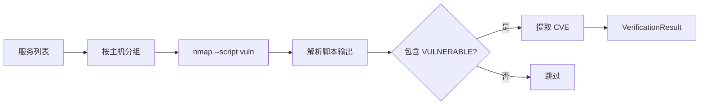
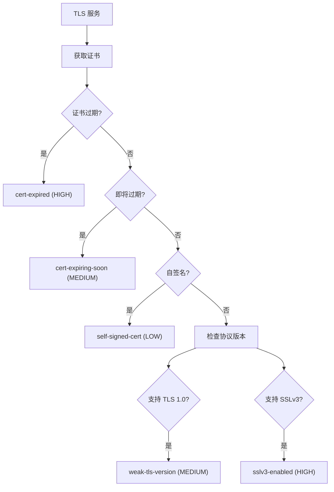

# 主动验证模块

> 理解弱密码检测、SSL 审计等主动验证功能

---

## 模块概述

主动验证模块位于 `src/vulnscan/verifiers/`，负责对发现的服务进行主动安全检测：

```
verifiers/
├── __init__.py
├── base.py                # 验证器基类
├── nse.py                 # Nmap NSE 脚本验证
├── weak_creds.py          # 弱密码检测
└── ssl_audit.py           # SSL/TLS 审计
```

**与被动漏洞匹配的区别**：

| 特性 | 被动匹配 (NVD) | 主动验证 |
|------|----------------|----------|
| 方式 | 根据版本号匹配已知 CVE | 实际尝试利用或检测 |
| 准确性 | 可能误报（版本已修复） | 确认漏洞存在 |
| 风险 | 无风险 | 可能触发告警 |
| 范围 | 已知 CVE | 配置问题、弱密码等 |

---

## 1. 验证器基类 (base.py)

所有验证器必须实现 `ServiceVerifier` 接口：

```python
# src/vulnscan/verifiers/base.py:11-31

class ServiceVerifier(ABC):
    """服务验证器基类"""

    @property
    @abstractmethod
    def name(self) -> str:
        """返回验证器名称"""
        pass

    @abstractmethod
    def verify(self, services: List[Service]) -> List[VerificationResult]:
        """
        对服务列表执行验证

        Args:
            services: 待验证的服务列表

        Returns:
            验证结果列表
        """
        pass
```

---

## 2. 验证结果数据结构

```python
# src/vulnscan/core/models.py:160-177

@dataclass
class VerificationResult:
    scan_id: int                     # 扫描 ID
    host_id: int                     # 主机 ID
    service_id: Optional[int] = None # 服务 ID
    id: Optional[int] = None         # 数据库主键
    verifier: str = ""               # 验证器名称
    name: str = ""                   # 发现的问题名称
    severity: Severity = Severity.LOW # 严重程度
    cve_id: Optional[str] = None     # 关联的 CVE（如有）
    description: Optional[str] = None # 问题描述
    evidence: Optional[str] = None   # 证据
    detected_at: Optional[datetime] = None  # 检测时间

    @property
    def is_confirmed(self) -> bool:
        """是否为已确认的严重问题"""
        return self.severity in (Severity.CRITICAL, Severity.HIGH)
```

---

## 3. NSE 脚本验证 (nse.py)

### 3.1 原理

使用 Nmap 的 NSE（Nmap Scripting Engine）漏洞扫描脚本检测已知漏洞。



### 3.2 NseVulnVerifier 类

```python
# src/vulnscan/verifiers/nse.py:23-79

class NseVulnVerifier(ServiceVerifier):
    """使用 Nmap NSE 脚本验证漏洞"""

    def __init__(self, timeout: float = None):
        self.timeout = timeout or config.scan.timeout * 10

    @property
    def name(self) -> str:
        return "NSE Vulnerability Scanner"

    def verify(self, services: List[Service]) -> List[VerificationResult]:
        results = []
        host_ports = self._group_ports_by_host(services)
        nm = nmap.PortScanner()

        for ip, ports in host_ports.items():
            # 构建 Nmap 参数
            args = self._build_args(ports)
            # 例如: "-sV --script vuln -p 22,80,443 --host-timeout 30s"

            nm.scan(hosts=ip, arguments=args)

            # 解析脚本输出
            for port, port_data in host_data.get("tcp", {}).items():
                for script_name, output in port_data.get("script", {}).items():
                    if self._is_vulnerable(output):
                        cves = re.findall(r"CVE-\d{4}-\d{4,7}", output)
                        results.append(VerificationResult(
                            verifier="nmap-nse",
                            name=script_name,
                            severity=Severity.HIGH,
                            cve_id=cves[0] if cves else None,
                            evidence=output[:500],
                        ))

        return results
```

### 3.3 漏洞判断逻辑

```python
# src/vulnscan/verifiers/nse.py:18-20

_VULN_RE = re.compile(r"(?i)\bVULNERABLE\b")
_NOT_VULN_RE = re.compile(r"(?i)NOT VULNERABLE")

def _is_vulnerable(self, output: str) -> bool:
    """判断脚本输出是否表明存在漏洞"""
    if not output:
        return False
    # 包含 "VULNERABLE" 且不包含 "NOT VULNERABLE"
    return bool(_VULN_RE.search(output)) and not _NOT_VULN_RE.search(output)
```

### 3.4 常见 NSE 漏洞脚本

| 脚本名 | 检测内容 |
|--------|----------|
| `smb-vuln-ms17-010` | 永恒之蓝 (WannaCry) |
| `ssl-heartbleed` | OpenSSL 心脏出血 |
| `http-shellshock` | Bash Shellshock |
| `mysql-vuln-cve2012-2122` | MySQL 认证绕过 |
| `ssh-vuln-cve2018-10933` | libssh 认证绕过 |

---

## 4. 弱密码检测 (weak_creds.py)

### 4.1 支持的服务

```python
# src/vulnscan/verifiers/weak_creds.py:50-60

def _is_ssh(self, svc: Service) -> bool:
    return svc.port == 22 or svc.service_name == "ssh"

def _is_mysql(self, svc: Service) -> bool:
    return svc.port == 3306 or svc.service_name in ("mysql", "mariadb")

def _is_redis(self, svc: Service) -> bool:
    return svc.port == 6379 or svc.service_name == "redis"

def _is_ftp(self, svc: Service) -> bool:
    return svc.port == 21 or svc.service_name == "ftp"
```

### 4.2 WeakPasswordVerifier 类

```python
# src/vulnscan/verifiers/weak_creds.py

class WeakPasswordVerifier(ServiceVerifier):
    """弱密码检测器"""

    # 默认密码字典
    DEFAULT_PASSWORDS = [
        "",           # 空密码
        "123456",
        "password",
        "admin",
        "root",
        "admin123",
        "root123",
        "test",
        "guest",
    ]

    def verify(self, services: List[Service]) -> List[VerificationResult]:
        results = []
        for svc in services:
            if self._is_ssh(svc):
                results.extend(self._check_ssh(svc))
            elif self._is_mysql(svc):
                results.extend(self._check_mysql(svc))
            elif self._is_redis(svc):
                results.extend(self._check_redis(svc))
            elif self._is_ftp(svc):
                results.extend(self._check_ftp(svc))
        return results
```

### 4.3 SSH 弱密码检测

```python
# src/vulnscan/verifiers/weak_creds.py:75-98

def _check_ssh(self, svc: Service) -> List[VerificationResult]:
    import paramiko  # 可选依赖

    users = ["root", "admin", "user"]
    for user in users:
        for pwd in self.passwords:
            client = paramiko.SSHClient()
            try:
                client.set_missing_host_key_policy(paramiko.AutoAddPolicy())
                client.connect(
                    svc.host_ip,
                    port=svc.port,
                    username=user,
                    password=pwd,
                    timeout=self.timeout,
                    allow_agent=False,
                    look_for_keys=False,
                )
                # 连接成功 = 弱密码
                return [self._result(
                    svc,
                    "ssh-weak-password",
                    f"user={user} password=******"
                )]
            except Exception:
                continue
            finally:
                client.close()
    return []
```

### 4.4 MySQL 弱密码检测

```python
# src/vulnscan/verifiers/weak_creds.py:100-122

def _check_mysql(self, svc: Service) -> List[VerificationResult]:
    import pymysql  # 可选依赖

    users = ["root", "admin"]
    for user in users:
        for pwd in self.passwords:
            try:
                conn = pymysql.connect(
                    host=svc.host_ip,
                    port=svc.port,
                    user=user,
                    password=pwd,
                    connect_timeout=int(self.timeout),
                )
                conn.close()
                return [self._result(
                    svc,
                    "mysql-weak-password",
                    f"user={user} password=******"
                )]
            except Exception:
                continue
    return []
```

### 4.5 Redis 未授权访问检测

```python
# src/vulnscan/verifiers/weak_creds.py:124-165

def _check_redis(self, svc: Service) -> List[VerificationResult]:
    # 检测无密码访问
    sock = socket.socket(socket.AF_INET, socket.SOCK_STREAM)
    sock.settimeout(self.timeout)
    sock.connect((svc.host_ip, svc.port))
    sock.send(b"PING\r\n")
    response = sock.recv(1024)

    if b"+PONG" in response:
        # PING 成功 = 无需认证
        return [self._result(
            svc,
            "redis-no-auth",
            "PING succeeded without AUTH"
        )]

    # 检测弱密码
    for pwd in self.passwords:
        if not pwd:
            continue
        sock.send(f"AUTH {pwd}\r\n".encode())
        response = sock.recv(1024)
        if b"+OK" in response:
            return [self._result(
                svc,
                "redis-weak-password",
                "password=******"
            )]

    return []
```

### 4.6 检测结果示例

| 服务 | 问题名称 | 严重程度 | 证据 |
|------|----------|----------|------|
| SSH:22 | ssh-weak-password | CRITICAL | user=root password=****** |
| MySQL:3306 | mysql-weak-password | CRITICAL | user=root password=****** |
| Redis:6379 | redis-no-auth | CRITICAL | PING succeeded without AUTH |
| FTP:21 | ftp-weak-password | CRITICAL | user=admin password=****** |

---

## 5. SSL/TLS 审计 (ssl_audit.py)

### 5.1 检测项目



### 5.2 TlsAuditVerifier 类

```python
# src/vulnscan/verifiers/ssl_audit.py:18-55

class TlsAuditVerifier(ServiceVerifier):
    """SSL/TLS 配置审计"""

    def __init__(self, timeout: float = None, expiry_days: int = 30):
        self.timeout = timeout or config.scan.timeout
        self.expiry_days = expiry_days  # 证书过期预警天数

    @property
    def name(self) -> str:
        return "SSL/TLS Auditor"

    def verify(self, services: List[Service]) -> List[VerificationResult]:
        results = []
        for svc in services:
            if not self._is_tls_service(svc):
                continue

            cert = self._fetch_cert(svc.host_ip, svc.port)
            if cert:
                now = datetime.utcnow()

                # 证书已过期
                if cert["not_after"] < now:
                    results.append(self._result(
                        svc, "cert-expired", Severity.HIGH, cert["summary"]
                    ))

                # 证书即将过期
                elif cert["not_after"] < now + timedelta(days=self.expiry_days):
                    results.append(self._result(
                        svc, "cert-expiring-soon", Severity.MEDIUM, cert["summary"]
                    ))

                # 自签名证书
                if cert["self_signed"]:
                    results.append(self._result(
                        svc, "self-signed-cert", Severity.LOW, cert["summary"]
                    ))

            # 检查弱协议版本
            if self._supports_tls10(svc.host_ip, svc.port):
                results.append(self._result(
                    svc, "weak-tls-version", Severity.MEDIUM, "TLS 1.0 enabled"
                ))

            if self._supports_sslv3(svc.host_ip, svc.port):
                results.append(self._result(
                    svc, "sslv3-enabled", Severity.HIGH, "SSLv3 enabled (POODLE)"
                ))

        return results
```

### 5.3 证书获取

```python
# src/vulnscan/verifiers/ssl_audit.py:61-87

def _fetch_cert(self, host: str, port: int) -> Optional[dict]:
    ctx = ssl.create_default_context()
    ctx.check_hostname = False
    ctx.verify_mode = ssl.CERT_NONE

    with socket.create_connection((host, port), timeout=self.timeout) as sock:
        with ctx.wrap_socket(sock, server_hostname=host) as ssock:
            cert = ssock.getpeercert()

    # 解析证书信息
    not_after = datetime.strptime(cert["notAfter"], "%b %d %H:%M:%S %Y %Z")
    subject = dict(x[0] for x in cert.get("subject", ()))
    issuer = dict(x[0] for x in cert.get("issuer", ()))

    # 判断自签名
    self_signed = subject.get("commonName") == issuer.get("commonName")

    return {
        "not_after": not_after,
        "self_signed": self_signed,
        "summary": f"CN={subject.get('commonName')} Expires={cert.get('notAfter')}",
    }
```

### 5.4 TLS 服务识别

```python
def _is_tls_service(self, svc: Service) -> bool:
    """判断是否为 TLS 服务"""
    tls_ports = {443, 465, 636, 853, 993, 995, 8443}
    tls_services = {"https", "ssl", "tls", "imaps", "pop3s", "smtps"}

    return (
        svc.port in tls_ports or
        (svc.service_name or "").lower() in tls_services
    )
```

---

## 6. 在流水线中的使用

验证器在扫描流水线的第 3 阶段被调用：

```python
# src/vulnscan/core/pipeline.py:307-324

def _verify_services(self, services: List[Service]) -> List[VerificationResult]:
    from ..verifiers import NseVulnVerifier, WeakPasswordVerifier, TlsAuditVerifier

    verifiers = [
        NseVulnVerifier(),
        WeakPasswordVerifier(),
        TlsAuditVerifier(),
    ]

    results = []
    for verifier in verifiers:
        try:
            results.extend(verifier.verify(services))
        except Exception as e:
            logger.warning(f"Verification {verifier.name} failed: {e}")

    return results
```

---

## 7. 可选依赖

弱密码检测需要额外安装依赖：

```bash
# 安装可选依赖
pip install vuln_scanner[verify]

# 或单独安装
pip install paramiko   # SSH 检测
pip install pymysql    # MySQL 检测
```

如果未安装，验证器会跳过对应的检测：

```python
def _check_ssh(self, svc: Service) -> List[VerificationResult]:
    try:
        import paramiko
    except ImportError:
        logger.debug("paramiko not installed; skipping SSH checks")
        return []
```

---

## 8. 扩展验证器

### 实现自定义验证器

```python
from vulnscan.verifiers.base import ServiceVerifier
from vulnscan.core.models import Service, VerificationResult, Severity

class CustomVerifier(ServiceVerifier):
    """自定义验证器示例"""

    @property
    def name(self) -> str:
        return "Custom Verifier"

    def verify(self, services: List[Service]) -> List[VerificationResult]:
        results = []

        for svc in services:
            # 检测逻辑
            if self._is_vulnerable(svc):
                results.append(VerificationResult(
                    scan_id=0,
                    host_id=svc.host_id,
                    service_id=svc.id,
                    verifier="custom",
                    name="custom-issue",
                    severity=Severity.HIGH,
                    description="Custom issue detected",
                    evidence="...",
                ))

        return results

    def _is_vulnerable(self, svc: Service) -> bool:
        # 实现检测逻辑
        pass
```

### 注册到流水线

```python
# 修改 pipeline.py 的 _verify_services 方法
from .custom_verifier import CustomVerifier

verifiers = [
    NseVulnVerifier(),
    WeakPasswordVerifier(),
    TlsAuditVerifier(),
    CustomVerifier(),  # 添加自定义验证器
]
```

---

## 9. 代码位置速查

| 功能 | 文件 | 关键类/方法 |
|------|------|------------|
| 验证器基类 | `verifiers/base.py` | `ServiceVerifier` |
| NSE 脚本验证 | `verifiers/nse.py` | `NseVulnVerifier.verify()` |
| 弱密码检测 | `verifiers/weak_creds.py` | `WeakPasswordVerifier._check_ssh()` |
| SSL 审计 | `verifiers/ssl_audit.py` | `TlsAuditVerifier._fetch_cert()` |
| 流水线调用 | `core/pipeline.py` | `_verify_services()` |

---

## 下一步

- [修复建议模块](06_remediation.md) - 了解如何生成修复建议
- [风险评分模块](04_scoring.md) - 回顾验证结果如何影响评分
- [开发指南：扩展验证器](../development/extending_verifiers.md) - 详细的扩展教程
