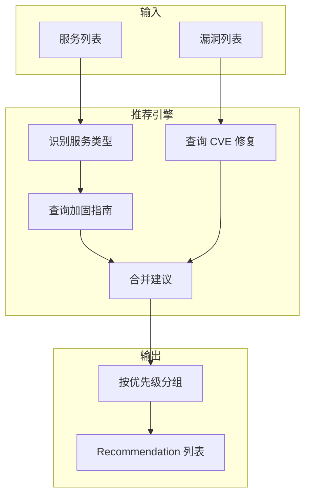

# 修复建议模块

> 理解如何生成漏洞修复建议和服务加固指南

---

## 模块概述

修复建议模块位于 `src/vulnscan/remediation/`，负责根据发现的漏洞和服务生成修复建议：

```
remediation/
├── __init__.py
├── engine.py              # 推荐引擎
└── knowledge_base.py      # 知识库（加固指南）
```

---

## 1. 建议生成流程



---

## 2. 数据结构

### Recommendation - 修复建议

```python
# src/vulnscan/remediation/engine.py:14-22

@dataclass
class Recommendation:
    title: str              # 建议标题
    description: str        # 问题描述
    action: str             # 具体修复步骤
    priority: str = "medium"  # 优先级: critical, high, medium, low
    source: str = "knowledge_base"  # 来源: knowledge_base, nvd, cve_specific
    reference: Optional[str] = None  # 参考链接
```

---

## 3. 推荐引擎 (engine.py)

### 3.1 RemediationEngine 类

```python
# src/vulnscan/remediation/engine.py:25-52

class RemediationEngine:
    """修复建议推荐引擎"""

    # 服务类型映射
    SERVICE_MAP = {
        "ssh": ["ssh", "openssh", "sshd"],
        "http": ["http", "https", "apache", "nginx", "httpd", "tomcat", "iis"],
        "mysql": ["mysql", "mariadb", "mysqld"],
        "redis": ["redis", "redis-server"],
        "ftp": ["ftp", "vsftpd", "proftpd", "pure-ftpd"],
        "smb": ["smb", "samba", "cifs", "microsoft-ds", "netbios"],
    }

    def __init__(self):
        self.guides = HARDENING_GUIDES
        self.cve_remediation = CVE_REMEDIATION

    def get_service_type(self, service_name: str, product: str = None) -> str:
        """将服务/产品名映射到已知服务类型"""
        check = (service_name or "").lower()
        if product:
            check += " " + product.lower()

        for svc_type, keywords in self.SERVICE_MAP.items():
            for kw in keywords:
                if kw in check:
                    return svc_type

        return "default"
```

### 3.2 获取服务加固建议

```python
# src/vulnscan/remediation/engine.py:54-74

def get_recommendations_for_service(
    self,
    service_name: str,
    product: str = None,
    version: str = None,
) -> List[Recommendation]:
    """
    获取服务的加固建议

    Args:
        service_name: 服务名称（如 ssh, http）
        product: 产品名称（如 Apache, OpenSSH）
        version: 版本号

    Returns:
        建议列表
    """
    svc_type = self.get_service_type(service_name, product)
    guide = self.guides.get(svc_type, self.guides["default"])

    recommendations = []
    for rec in guide["recommendations"]:
        recommendations.append(Recommendation(
            title=rec["title"],
            description=rec["description"],
            action=rec["action"],
            priority=rec["priority"],
            source="knowledge_base",
        ))

    return recommendations
```

### 3.3 获取 CVE 修复建议

```python
# src/vulnscan/remediation/engine.py:76-113

def get_recommendations_for_vuln(
    self,
    cve_id: str,
    description: str = None,
) -> List[Recommendation]:
    """
    获取 CVE 的修复建议

    Args:
        cve_id: CVE 编号（如 CVE-2021-44228）

    Returns:
        建议列表
    """
    recommendations = []
    cve_id = cve_id.strip().upper()

    # 检查是否有已知的 CVE 修复方案
    if cve_id in self.cve_remediation:
        cve_info = self.cve_remediation[cve_id]
        recommendations.append(Recommendation(
            title=f"修复 {cve_id}: {cve_info['title']}",
            description=cve_info.get("title", ""),
            action=cve_info["action"],
            priority="critical",
            source="cve_specific",
            reference=cve_info.get("reference"),
        ))
    else:
        # 通用 CVE 修复建议
        recommendations.append(Recommendation(
            title=f"修复 {cve_id}",
            description="应用厂商发布的安全补丁",
            action="访问 NVD (nvd.nist.gov) 查看详细修复信息和厂商公告",
            priority="high",
            source="nvd",
            reference=f"https://nvd.nist.gov/vuln/detail/{cve_id}",
        ))

    return recommendations
```

---

## 4. 知识库 (knowledge_base.py)

### 4.1 服务加固指南

知识库包含常见服务的安全加固建议：

#### SSH 加固

```python
# src/vulnscan/remediation/knowledge_base.py:6-33

"ssh": {
    "name": "OpenSSH",
    "recommendations": [
        {
            "title": "禁用密码认证",
            "description": "使用密钥认证替代密码认证，防止暴力破解攻击",
            "action": "编辑 /etc/ssh/sshd_config，设置 PasswordAuthentication no",
            "priority": "high",
        },
        {
            "title": "禁用 root 直接登录",
            "description": "防止攻击者直接获取最高权限",
            "action": "设置 PermitRootLogin no 或 PermitRootLogin prohibit-password",
            "priority": "high",
        },
        {
            "title": "限制 SSH 访问用户",
            "description": "仅允许特定用户通过 SSH 登录",
            "action": "使用 AllowUsers 或 AllowGroups 指令限制登录用户",
            "priority": "medium",
        },
        {
            "title": "更改默认端口",
            "description": "避免自动化扫描器发现 SSH 服务",
            "action": "修改 Port 22 为其他端口（如 2222）",
            "priority": "low",
        },
    ],
}
```

#### HTTP 服务器加固

```python
"http": {
    "name": "HTTP Server (Apache/Nginx)",
    "recommendations": [
        {
            "title": "启用 HTTPS",
            "description": "加密传输数据，防止中间人攻击",
            "action": "配置 SSL/TLS 证书，强制 HTTPS 重定向",
            "priority": "critical",
        },
        {
            "title": "添加安全响应头",
            "description": "防止 XSS、点击劫持等攻击",
            "action": "添加 X-Frame-Options, X-Content-Type-Options, CSP 等头部",
            "priority": "high",
        },
        {
            "title": "禁用目录列表",
            "description": "防止敏感文件泄露",
            "action": "Apache: Options -Indexes; Nginx: autoindex off",
            "priority": "medium",
        },
        {
            "title": "隐藏服务器版本",
            "description": "减少攻击者可用信息",
            "action": "Apache: ServerTokens Prod; Nginx: server_tokens off",
            "priority": "low",
        },
    ],
}
```

#### MySQL 加固

```python
"mysql": {
    "name": "MySQL/MariaDB",
    "recommendations": [
        {
            "title": "运行安全加固脚本",
            "description": "删除匿名用户、测试数据库，设置 root 密码",
            "action": "执行 mysql_secure_installation",
            "priority": "critical",
        },
        {
            "title": "禁止远程 root 登录",
            "description": "限制 root 仅本地访问",
            "action": "DELETE FROM mysql.user WHERE User='root' AND Host NOT IN ('localhost', '127.0.0.1')",
            "priority": "high",
        },
        {
            "title": "使用强密码策略",
            "description": "防止弱密码被破解",
            "action": "启用 validate_password 插件",
            "priority": "high",
        },
    ],
}
```

#### Redis 加固

```python
"redis": {
    "name": "Redis",
    "recommendations": [
        {
            "title": "设置访问密码",
            "description": "防止未授权访问",
            "action": "在 redis.conf 中设置 requirepass <strong_password>",
            "priority": "critical",
        },
        {
            "title": "禁用危险命令",
            "description": "防止配置被篡改或数据被清除",
            "action": "使用 rename-command 重命名或禁用 FLUSHALL, CONFIG, DEBUG 等命令",
            "priority": "high",
        },
        {
            "title": "绑定本地接口",
            "description": "禁止外网直接访问",
            "action": "设置 bind 127.0.0.1 或仅绑定内网 IP",
            "priority": "high",
        },
    ],
}
```

#### SMB 加固

```python
"smb": {
    "name": "SMB/CIFS",
    "recommendations": [
        {
            "title": "禁用 SMBv1",
            "description": "SMBv1 存在严重漏洞（如 EternalBlue）",
            "action": "设置 min protocol = SMB2",
            "priority": "critical",
        },
        {
            "title": "要求签名",
            "description": "防止中间人攻击",
            "action": "设置 server signing = required",
            "priority": "high",
        },
    ],
}
```

### 4.2 CVE 专项修复

针对知名 CVE 的专项修复指南：

```python
# src/vulnscan/remediation/knowledge_base.py:199-215

CVE_REMEDIATION = {
    "CVE-2021-44228": {
        "title": "Log4j RCE (Log4Shell)",
        "action": "升级 Log4j 至 2.17.0 或更高版本；或设置 log4j2.formatMsgNoLookups=true",
        "reference": "https://logging.apache.org/log4j/2.x/security.html",
    },
    "CVE-2017-0144": {
        "title": "EternalBlue (MS17-010)",
        "action": "安装 MS17-010 安全更新；禁用 SMBv1",
        "reference": "https://docs.microsoft.com/en-us/security-updates/securitybulletins/2017/ms17-010",
    },
    "CVE-2014-0160": {
        "title": "Heartbleed",
        "action": "升级 OpenSSL 至 1.0.1g 或更高版本；重新生成 SSL 证书和密钥",
        "reference": "https://heartbleed.com/",
    },
    # ... 更多 CVE
}
```

---

## 5. 便捷函数

### 获取建议

```python
# src/vulnscan/remediation/engine.py:116-133

def get_recommendations(
    service_name: str = None,
    product: str = None,
    cve_id: str = None,
) -> List[Recommendation]:
    """
    获取修复建议的便捷函数

    Args:
        service_name: 服务名称
        product: 产品名称
        cve_id: CVE 编号

    Returns:
        建议列表
    """
    engine = RemediationEngine()
    recommendations = []

    if cve_id:
        recommendations.extend(engine.get_recommendations_for_vuln(cve_id))

    if service_name:
        recommendations.extend(
            engine.get_recommendations_for_service(service_name, product)
        )

    return recommendations
```

### 获取建议摘要

```python
# src/vulnscan/remediation/engine.py:136-188

def get_recommendations_summary(
    services: list,
    vulnerabilities: list,
) -> Dict[str, Any]:
    """
    生成扫描结果的建议摘要

    Args:
        services: Service 对象列表
        vulnerabilities: Vulnerability 对象列表

    Returns:
        {
            "total": 15,           # 总建议数
            "by_priority": {       # 按优先级分组
                "critical": [...],
                "high": [...],
                "medium": [...],
                "low": [...],
            },
            "critical_count": 3,   # 紧急建议数
            "high_count": 5,       # 高优先级建议数
        }
    """
```

---

## 6. 使用示例

### 获取服务加固建议

```python
from vulnscan.remediation import RemediationEngine, get_recommendations

# 使用引擎
engine = RemediationEngine()
recs = engine.get_recommendations_for_service("ssh", "OpenSSH")

for rec in recs:
    print(f"[{rec.priority}] {rec.title}")
    print(f"  操作: {rec.action}")

# 输出:
# [high] 禁用密码认证
#   操作: 编辑 /etc/ssh/sshd_config，设置 PasswordAuthentication no
# [high] 禁用 root 直接登录
#   操作: 设置 PermitRootLogin no 或 PermitRootLogin prohibit-password
# ...
```

### 获取 CVE 修复建议

```python
# 已知 CVE 的专项修复
recs = engine.get_recommendations_for_vuln("CVE-2021-44228")
print(recs[0].action)
# 输出: 升级 Log4j 至 2.17.0 或更高版本；或设置 log4j2.formatMsgNoLookups=true

# 未知 CVE 的通用建议
recs = engine.get_recommendations_for_vuln("CVE-2024-12345")
print(recs[0].action)
# 输出: 访问 NVD (nvd.nist.gov) 查看详细修复信息和厂商公告
```

### 生成扫描报告建议

```python
from vulnscan.remediation.engine import get_recommendations_summary

# 假设已有扫描结果
summary = get_recommendations_summary(services, vulnerabilities)

print(f"总建议数: {summary['total']}")
print(f"紧急修复: {summary['critical_count']}")
print(f"高优先级: {summary['high_count']}")

# 输出紧急建议
for rec in summary["by_priority"]["critical"]:
    print(f"- {rec['title']}: {rec['action']}")
```

---

## 7. 优先级说明

| 优先级 | 含义 | 处理时限建议 |
|--------|------|-------------|
| `critical` | 紧急 - 存在主动利用或高危风险 | 立即处理 |
| `high` | 高 - 重要安全加固措施 | 24-48 小时内 |
| `medium` | 中 - 最佳实践建议 | 1 周内 |
| `low` | 低 - 防御加深措施 | 计划中处理 |

---

## 8. 扩展知识库

### 添加新服务加固指南

```python
# 在 knowledge_base.py 的 HARDENING_GUIDES 中添加

"mongodb": {
    "name": "MongoDB",
    "recommendations": [
        {
            "title": "启用认证",
            "description": "防止未授权访问",
            "action": "在 mongod.conf 中启用 security.authorization: enabled",
            "priority": "critical",
        },
        {
            "title": "绑定本地接口",
            "description": "禁止外网直接访问",
            "action": "设置 bindIp: 127.0.0.1 或内网 IP",
            "priority": "high",
        },
    ],
}
```

### 添加新 CVE 修复指南

```python
# 在 knowledge_base.py 的 CVE_REMEDIATION 中添加

"CVE-2023-XXXXX": {
    "title": "漏洞名称",
    "action": "具体修复步骤",
    "reference": "https://example.com/advisory",
},
```

---

## 9. 代码位置速查

| 功能 | 文件 | 关键函数/类 |
|------|------|------------|
| 推荐引擎 | `remediation/engine.py` | `RemediationEngine` |
| 服务建议 | `remediation/engine.py` | `get_recommendations_for_service()` |
| CVE 建议 | `remediation/engine.py` | `get_recommendations_for_vuln()` |
| 建议摘要 | `remediation/engine.py` | `get_recommendations_summary()` |
| 加固指南 | `remediation/knowledge_base.py` | `HARDENING_GUIDES` |
| CVE 修复 | `remediation/knowledge_base.py` | `CVE_REMEDIATION` |

---

## 下一步

- [报告生成模块](07_reporting.md) - 了解建议如何展示在报告中
- [主动验证模块](05_verifiers.md) - 回顾验证结果与建议的关联
- [CLI 接口](../interfaces/cli.md) - 了解如何通过命令行获取建议
