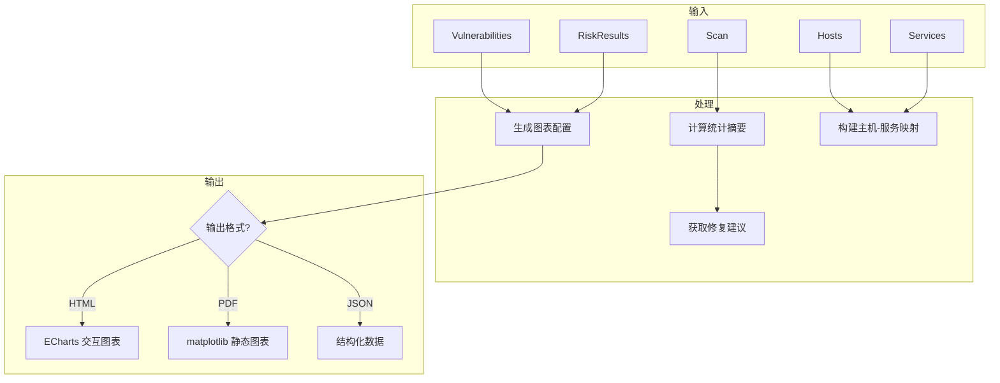

# 报告生成模块

> 理解 HTML、PDF、JSON 报告的生成原理

---

## 模块概述

报告生成模块位于 `src/vulnscan/reporting/`，负责将扫描结果转化为可视化报告：

```
reporting/
├── __init__.py
├── generator.py           # 报告生成器
├── charts.py              # 图表生成
├── topology.py            # 网络拓扑图
└── templates/             # Jinja2 模板（内嵌）
```

---

## 1. 报告生成流程



---

## 2. ReportGenerator 类

### 2.1 初始化

```python
# src/vulnscan/reporting/generator.py

class ReportGenerator:
    """
    生成 HTML 格式的专业安全报告

    特性：
    - Bootstrap 5 响应式布局
    - ECharts 交互式图表（HTML）
    - matplotlib 静态图表（PDF）
    - 支持中英文切换
    - 支持打印优化
    """

    def __init__(self, language: str = "zh_CN"):
        self.language = language
        self.charts = ChartGenerator()
        self.i18n = I18N_ZH if language.startswith("zh") else I18N_EN
```

### 2.2 生成 HTML 报告

```python
# src/vulnscan/reporting/generator.py:371-473

def generate(
    self,
    scan: Scan,
    hosts: List[Host],
    services: List[Service],
    vulnerabilities: List[Vulnerability],
    risk_results: List[HostRiskResult],
    output_path: Optional[Path] = None,
) -> str:
    """
    生成 HTML 报告

    Args:
        scan: 扫描任务对象
        hosts: 发现的主机列表
        services: 发现的服务列表
        vulnerabilities: 匹配的漏洞列表
        risk_results: 风险评估结果
        output_path: 可选的保存路径

    Returns:
        HTML 字符串
    """
    # 1. 计算统计摘要
    summary = calculate_scan_risk_summary(risk_results)

    # 2. 构建主机-服务映射
    host_services = {}
    for svc in services:
        host_services.setdefault(svc.host_ip, []).append(svc)

    # 3. 生成漏洞严重程度饼图配置
    severity_chart = self.charts.severity_pie_chart(
        summary["critical_vulns"],
        summary["high_vulns"],
        summary["medium_vulns"],
        summary["low_vulns"],
    )

    # 4. 生成主机风险柱状图配置
    top_hosts = sorted(risk_results, key=lambda r: r.risk_score, reverse=True)[:10]
    risk_chart = self.charts.risk_bar_chart(host_ips, host_scores)

    # 5. 获取修复建议
    recommendations = get_recommendations_summary(services, vulnerabilities)

    # 6. 渲染 Jinja2 模板
    html = template.render(
        scan=scan,
        hosts=hosts,
        services=services,
        vulnerabilities=vulnerabilities,
        summary=summary,
        recommendations=recommendations,
        severity_chart_json=json.dumps(severity_chart),
        risk_chart_json=json.dumps(risk_chart),
    )

    # 7. 保存文件
    if output_path:
        output_path.write_text(html, encoding="utf-8")

    return html
```

### 2.3 生成 PDF 报告

```python
# src/vulnscan/reporting/generator.py:553-620

def generate_pdf(
    self,
    scan: Scan,
    hosts: List[Host],
    services: List[Service],
    vulnerabilities: List[Vulnerability],
    risk_results: List[HostRiskResult],
    output_path: Path,
) -> bytes:
    """
    生成 PDF 报告

    使用 WeasyPrint 将 HTML 转换为 PDF
    图表使用 matplotlib 生成静态图片
    """
    from weasyprint import HTML, CSS
    from weasyprint.text.fonts import FontConfiguration

    # 生成静态图表（PDF 不支持 JavaScript）
    severity_chart_image = self.charts.severity_pie_chart_image(
        total_critical, total_high, total_medium, total_low
    )
    risk_chart_image = self.charts.risk_bar_chart_image(host_ips, host_scores)

    # 生成 HTML（带静态图表）
    html = self.generate(
        scan=scan,
        hosts=hosts,
        services=services,
        vulnerabilities=vulnerabilities,
        risk_results=risk_results,
        severity_chart_image=severity_chart_image,
        risk_chart_image=risk_chart_image,
    )

    # 配置字体（支持中文）
    font_config = FontConfiguration()
    css = CSS(string='''
        @font-face {
            font-family: 'Noto Sans CJK SC';
            src: local('Noto Sans CJK SC');
        }
        body { font-family: 'Noto Sans CJK SC', sans-serif; }
    ''', font_config=font_config)

    # 转换为 PDF
    pdf_bytes = HTML(string=html).write_pdf(
        stylesheets=[css],
        font_config=font_config,
    )

    output_path.write_bytes(pdf_bytes)
    return pdf_bytes
```

### 2.4 生成 JSON 报告

```python
# src/vulnscan/reporting/generator.py:475-550

def generate_json(
    self,
    scan: Scan,
    hosts: List[Host],
    services: List[Service],
    vulnerabilities: List[Vulnerability],
    risk_results: List[HostRiskResult],
) -> Dict[str, Any]:
    """
    生成 JSON 格式报告数据

    Returns:
        {
            "scan": {...},
            "summary": {...},
            "hosts": [...],
            "services": [...],
            "vulnerabilities": [...],
            "risk_results": [...],
        }
    """
```

---

## 3. 图表生成 (charts.py)

### 3.1 ChartGenerator 类

```python
class ChartGenerator:
    """图表生成器"""

    # 严重程度颜色
    SEVERITY_COLORS = {
        "CRITICAL": "#F85149",  # 红色
        "HIGH": "#DB6D28",      # 橙色
        "MEDIUM": "#D29922",    # 黄色
        "LOW": "#3FB950",       # 绿色
    }

    # 风险等级颜色
    RISK_COLORS = {
        "Critical": "#F85149",
        "High": "#DB6D28",
        "Medium": "#D29922",
        "Low": "#3FB950",
    }
```

### 3.2 ECharts 饼图配置（HTML 用）

```python
def severity_pie_chart(
    self,
    critical: int,
    high: int,
    medium: int,
    low: int,
    title: str = "Vulnerability Severity Distribution",
) -> Dict[str, Any]:
    """
    生成 ECharts 饼图配置

    Returns:
        ECharts option 字典（前端直接使用）
    """
    return {
        "title": {"text": title, "left": "center"},
        "tooltip": {"trigger": "item"},
        "legend": {"orient": "vertical", "left": "left"},
        "series": [{
            "type": "pie",
            "radius": "50%",
            "data": [
                {"value": critical, "name": "Critical", "itemStyle": {"color": "#F85149"}},
                {"value": high, "name": "High", "itemStyle": {"color": "#DB6D28"}},
                {"value": medium, "name": "Medium", "itemStyle": {"color": "#D29922"}},
                {"value": low, "name": "Low", "itemStyle": {"color": "#3FB950"}},
            ],
        }],
    }
```

### 3.3 matplotlib 静态图表（PDF 用）

```python
# src/vulnscan/reporting/charts.py:280-323

def severity_pie_chart_image(
    self,
    critical: int,
    high: int,
    medium: int,
    low: int,
    title: str = "Severity Distribution",
) -> str:
    """
    生成 matplotlib 饼图，返回 base64 编码的 PNG

    PDF 报告不支持 JavaScript，需要使用静态图片
    """
    import matplotlib
    matplotlib.use('Agg')  # 无头模式
    import matplotlib.pyplot as plt

    # 设置中文字体
    plt.rcParams['font.sans-serif'] = ['Noto Sans CJK SC', 'SimHei', 'sans-serif']

    labels, sizes, colors = [], [], []
    for name, count, color in [
        ("Critical", critical, "#F85149"),
        ("High", high, "#DB6D28"),
        ("Medium", medium, "#D29922"),
        ("Low", low, "#3FB950"),
    ]:
        if count > 0:
            labels.append(name)
            sizes.append(count)
            colors.append(color)

    fig, ax = plt.subplots(figsize=(6, 4))
    ax.pie(sizes, labels=labels, colors=colors, autopct='%1.1f%%')
    ax.set_title(title)

    # 转换为 base64
    buf = io.BytesIO()
    plt.savefig(buf, format='png', dpi=150, bbox_inches='tight')
    plt.close(fig)
    buf.seek(0)
    return base64.b64encode(buf.getvalue()).decode('utf-8')
```

### 3.4 风险评分柱状图

```python
# src/vulnscan/reporting/charts.py:325-370

def risk_bar_chart_image(
    self,
    hosts: List[str],
    scores: List[float],
    title: str = "Host Risk Scores",
) -> str:
    """生成主机风险评分柱状图"""
    # 根据评分设置颜色
    colors = []
    for score in scores:
        if score >= 70:
            colors.append("#F85149")   # Critical
        elif score >= 40:
            colors.append("#DB6D28")   # High
        elif score >= 20:
            colors.append("#D29922")   # Medium
        else:
            colors.append("#3FB950")   # Low

    fig, ax = plt.subplots(figsize=(8, 4))
    bars = ax.barh(hosts, scores, color=colors)
    ax.set_xlim(0, 100)
    ax.set_xlabel('Risk Score')
    ax.set_title(title)
    ax.invert_yaxis()  # 最高分在顶部

    # 添加数值标签
    for bar, score in zip(bars, scores):
        ax.text(score + 2, bar.get_y() + bar.get_height()/2, f'{score:.1f}')

    # 转换为 base64
    ...
```

---

## 4. 网络拓扑图 (topology.py)

### 4.1 拓扑数据生成

```python
# src/vulnscan/reporting/topology.py:100-127

def generate_topology_data(
    hosts: List[Host],
    services: List[Service],
    risk_results: List[HostRiskResult],
) -> Dict[str, Any]:
    """
    生成网络拓扑数据

    节点：每台主机
    连线：同子网的主机相连
    颜色：按风险等级着色
    """
    nodes = []
    links = []

    # 按子网分组
    subnet_groups = {}
    for host in hosts:
        subnet = ".".join(host.ip.split(".")[:3])  # /24 子网
        subnet_groups.setdefault(subnet, []).append(host.ip)

    # 创建节点
    for host in hosts:
        risk = risk_map.get(host.id)
        color = RISK_COLORS.get(risk.risk_level.value if risk else "Info")
        nodes.append({
            "name": host.ip,
            "value": risk.risk_score if risk else 0,
            "symbolSize": 30 + (risk.risk_score / 5 if risk else 0),
            "itemStyle": {"color": color},
        })

    # 创建连线（同子网内星形拓扑）
    for subnet, ips in subnet_groups.items():
        if len(ips) > 1:
            hub = ips[0]
            for ip in ips[1:]:
                links.append({
                    "source": hub,
                    "target": ip,
                    "lineStyle": {"color": "#30363D"},
                })

    # 跨子网连接（虚线）
    subnet_hubs = [ips[0] for ips in subnet_groups.values()]
    for i in range(len(subnet_hubs) - 1):
        links.append({
            "source": subnet_hubs[i],
            "target": subnet_hubs[i + 1],
            "lineStyle": {"color": "#58A6FF", "type": "dashed"},
        })

    return {"nodes": nodes, "links": links}
```

### 4.2 ECharts 完整配置

```python
# src/vulnscan/reporting/topology.py:130-183

def generate_topology_for_api(
    hosts: List[Host],
    services: List[Service],
    risk_results: List[HostRiskResult],
) -> Dict[str, Any]:
    """
    生成完整的 ECharts 拓扑图配置

    Returns:
        完整的 ECharts option 对象
    """
    data = generate_topology_data(hosts, services, risk_results)

    return {
        "backgroundColor": "#161B22",
        "tooltip": {"trigger": "item"},
        "legend": {
            "data": ["Critical", "High", "Medium", "Low", "Info"],
        },
        "series": [{
            "type": "graph",
            "layout": "force",
            "data": data["nodes"],
            "links": data["links"],
            "roam": True,           # 允许拖拽缩放
            "draggable": True,      # 节点可拖拽
            "force": {
                "repulsion": 300,   # 斥力
                "edgeLength": [80, 150],
            },
            "emphasis": {
                "focus": "adjacency",  # 高亮相邻节点
            },
        }],
    }
```

---

## 5. 国际化支持

```python
I18N_ZH = {
    "report_title": "漏洞扫描报告",
    "scan_summary": "扫描摘要",
    "target": "扫描目标",
    "scan_time": "扫描时间",
    "duration": "耗时",
    "hosts_found": "发现主机",
    "services_found": "发现服务",
    "vulns_found": "发现漏洞",
    "risk_distribution": "风险分布",
    "vulnerability_details": "漏洞详情",
    "remediation": "修复建议",
    ...
}

I18N_EN = {
    "report_title": "Vulnerability Scan Report",
    "scan_summary": "Scan Summary",
    ...
}
```

---

## 6. 使用示例

### 生成 HTML 报告

```python
from vulnscan.reporting import ReportGenerator

generator = ReportGenerator(language="zh_CN")
html = generator.generate(
    scan=scan,
    hosts=hosts,
    services=services,
    vulnerabilities=vulnerabilities,
    risk_results=risk_results,
    output_path=Path("report.html"),
)
```

### 生成 PDF 报告

```python
generator.generate_pdf(
    scan=scan,
    hosts=hosts,
    services=services,
    vulnerabilities=vulnerabilities,
    risk_results=risk_results,
    output_path=Path("report.pdf"),
)
```

### 生成 JSON 数据

```python
data = generator.generate_json(
    scan=scan,
    hosts=hosts,
    services=services,
    vulnerabilities=vulnerabilities,
    risk_results=risk_results,
)
```

---

## 7. 代码位置速查

| 功能 | 文件 | 关键方法 |
|------|------|----------|
| HTML 报告 | `reporting/generator.py` | `ReportGenerator.generate()` |
| PDF 报告 | `reporting/generator.py` | `ReportGenerator.generate_pdf()` |
| JSON 报告 | `reporting/generator.py` | `ReportGenerator.generate_json()` |
| ECharts 图表 | `reporting/charts.py` | `ChartGenerator.severity_pie_chart()` |
| matplotlib 图表 | `reporting/charts.py` | `ChartGenerator.severity_pie_chart_image()` |
| 网络拓扑 | `reporting/topology.py` | `generate_topology_for_api()` |

---

## 下一步

- [数据存储模块](08_storage.md) - 了解报告数据如何存储
- [CLI 接口](../interfaces/cli.md) - 了解如何通过命令行生成报告
- [Web API 接口](../interfaces/web_api.md) - 了解如何通过 API 获取报告
