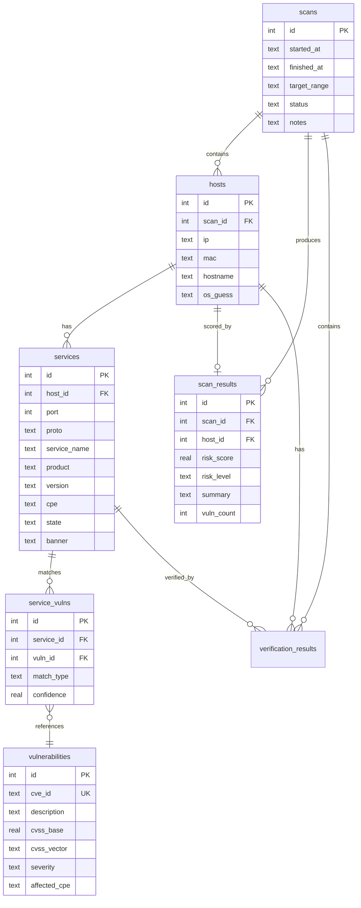

# 数据存储模块

> 理解数据库表结构和数据访问层

---

## 模块概述

数据存储模块位于 `src/vulnscan/storage/`，负责所有数据的持久化存储：

```
storage/
├── __init__.py
├── database.py            # 数据库连接管理
├── schema.py              # 表结构定义
└── repository.py          # 数据访问仓储层
```

**技术选型**：SQLite

- 零配置，单文件部署
- 适合单机扫描场景
- 内置于 Python 标准库

---

## 1. 数据库表结构

### 1.1 ER 图



### 1.2 表结构详解

#### scans - 扫描任务表

```sql
CREATE TABLE IF NOT EXISTS scans (
    id INTEGER PRIMARY KEY AUTOINCREMENT,
    started_at TEXT NOT NULL,       -- 开始时间 (ISO 格式)
    finished_at TEXT,               -- 结束时间
    target_range TEXT NOT NULL,     -- 扫描目标 (如 192.168.1.0/24)
    status TEXT NOT NULL DEFAULT 'pending',  -- pending/running/completed/failed
    notes TEXT                      -- 备注
);
```

#### hosts - 发现的主机表

```sql
CREATE TABLE IF NOT EXISTS hosts (
    id INTEGER PRIMARY KEY AUTOINCREMENT,
    scan_id INTEGER NOT NULL,       -- 所属扫描任务
    ip TEXT NOT NULL,               -- IP 地址
    mac TEXT,                       -- MAC 地址
    hostname TEXT,                  -- 主机名
    os_guess TEXT,                  -- 操作系统猜测
    FOREIGN KEY(scan_id) REFERENCES scans(id) ON DELETE CASCADE
);
```

#### services - 服务/端口表

```sql
CREATE TABLE IF NOT EXISTS services (
    id INTEGER PRIMARY KEY AUTOINCREMENT,
    host_id INTEGER NOT NULL,       -- 所属主机
    port INTEGER NOT NULL,          -- 端口号
    proto TEXT NOT NULL DEFAULT 'tcp',  -- 协议 (tcp/udp)
    service_name TEXT,              -- 服务名 (如 http, ssh)
    product TEXT,                   -- 产品名 (如 Apache)
    version TEXT,                   -- 版本号
    cpe TEXT,                       -- CPE 标识符
    state TEXT NOT NULL DEFAULT 'open',  -- 端口状态
    banner TEXT,                    -- Banner 信息
    FOREIGN KEY(host_id) REFERENCES hosts(id) ON DELETE CASCADE
);
```

#### vulnerabilities - 漏洞表 (NVD 缓存)

```sql
CREATE TABLE IF NOT EXISTS vulnerabilities (
    id INTEGER PRIMARY KEY AUTOINCREMENT,
    cve_id TEXT NOT NULL UNIQUE,    -- CVE 编号 (唯一)
    description TEXT,               -- 漏洞描述
    cvss_base REAL DEFAULT 0.0,     -- CVSS 基础分
    cvss_vector TEXT,               -- CVSS 向量
    severity TEXT,                  -- 严重程度 (CRITICAL/HIGH/MEDIUM/LOW)
    published_at TEXT,              -- 发布时间
    last_modified TEXT,             -- 最后修改时间
    affected_cpe TEXT,              -- 受影响的 CPE
    solution TEXT                   -- 修复建议
);
```

#### service_vulns - 服务-漏洞关联表

```sql
CREATE TABLE IF NOT EXISTS service_vulns (
    id INTEGER PRIMARY KEY AUTOINCREMENT,
    service_id INTEGER NOT NULL,    -- 服务 ID
    vuln_id INTEGER NOT NULL,       -- 漏洞 ID
    match_type TEXT NOT NULL DEFAULT 'cpe_exact',  -- 匹配类型
    confidence REAL DEFAULT 1.0,    -- 置信度 (0-1)
    FOREIGN KEY(service_id) REFERENCES services(id) ON DELETE CASCADE,
    FOREIGN KEY(vuln_id) REFERENCES vulnerabilities(id) ON DELETE CASCADE
);
```

#### scan_results - 风险评估结果表

```sql
CREATE TABLE IF NOT EXISTS scan_results (
    id INTEGER PRIMARY KEY AUTOINCREMENT,
    scan_id INTEGER NOT NULL,       -- 扫描任务 ID
    host_id INTEGER NOT NULL,       -- 主机 ID
    risk_score REAL NOT NULL DEFAULT 0.0,  -- 风险评分 (0-100)
    risk_level TEXT NOT NULL DEFAULT 'Low',  -- 风险等级
    summary TEXT,                   -- 评估摘要
    vuln_count INTEGER DEFAULT 0,   -- 总漏洞数
    critical_count INTEGER DEFAULT 0,  -- CRITICAL 漏洞数
    high_count INTEGER DEFAULT 0,   -- HIGH 漏洞数
    medium_count INTEGER DEFAULT 0, -- MEDIUM 漏洞数
    low_count INTEGER DEFAULT 0,    -- LOW 漏洞数
    FOREIGN KEY(scan_id) REFERENCES scans(id) ON DELETE CASCADE,
    FOREIGN KEY(host_id) REFERENCES hosts(id) ON DELETE CASCADE
);
```

#### verification_results - 主动验证结果表

```sql
CREATE TABLE IF NOT EXISTS verification_results (
    id INTEGER PRIMARY KEY AUTOINCREMENT,
    scan_id INTEGER NOT NULL,       -- 扫描任务 ID
    host_id INTEGER NOT NULL,       -- 主机 ID
    service_id INTEGER,             -- 服务 ID (可选)
    verifier TEXT NOT NULL,         -- 验证器名称
    name TEXT NOT NULL,             -- 检测项名称
    severity TEXT,                  -- 严重程度
    cve_id TEXT,                    -- 关联的 CVE
    description TEXT,               -- 描述
    evidence TEXT,                  -- 证据
    detected_at TEXT,               -- 检测时间
    FOREIGN KEY(scan_id) REFERENCES scans(id) ON DELETE CASCADE,
    FOREIGN KEY(host_id) REFERENCES hosts(id) ON DELETE CASCADE,
    FOREIGN KEY(service_id) REFERENCES services(id) ON DELETE SET NULL
);
```

#### NVD 缓存相关表

```sql
-- 缓存元数据
CREATE TABLE IF NOT EXISTS nvd_cache_meta (
    id INTEGER PRIMARY KEY AUTOINCREMENT,
    cpe_pattern TEXT NOT NULL UNIQUE,  -- CPE 模式
    last_updated TEXT NOT NULL,        -- 最后更新时间
    result_count INTEGER DEFAULT 0     -- 结果数量
);

-- 同步状态 (单例)
CREATE TABLE IF NOT EXISTS nvd_sync_state (
    id INTEGER PRIMARY KEY CHECK (id = 1),
    last_full_sync TEXT,            -- 最后全量同步时间
    last_incremental_sync TEXT,     -- 最后增量同步时间
    total_cve_count INTEGER DEFAULT 0,
    is_initialized INTEGER DEFAULT 0
);

-- 数据包导入记录
CREATE TABLE IF NOT EXISTS nvd_feed_imports (
    id INTEGER PRIMARY KEY AUTOINCREMENT,
    year INTEGER NOT NULL UNIQUE,   -- 年份
    imported_at TEXT NOT NULL,      -- 导入时间
    cve_count INTEGER DEFAULT 0,    -- CVE 数量
    sha256 TEXT                     -- 文件哈希
);
```

### 1.3 索引优化

```sql
-- 主机查询优化
CREATE INDEX IF NOT EXISTS idx_hosts_scan ON hosts(scan_id);
CREATE INDEX IF NOT EXISTS idx_hosts_ip ON hosts(ip);

-- 服务查询优化
CREATE INDEX IF NOT EXISTS idx_services_host ON services(host_id);
CREATE INDEX IF NOT EXISTS idx_services_port ON services(port);

-- 漏洞查询优化
CREATE INDEX IF NOT EXISTS idx_vulns_cve ON vulnerabilities(cve_id);
CREATE INDEX IF NOT EXISTS idx_vulns_severity ON vulnerabilities(severity);

-- 关联查询优化
CREATE INDEX IF NOT EXISTS idx_service_vulns_service ON service_vulns(service_id);
CREATE INDEX IF NOT EXISTS idx_service_vulns_vuln ON service_vulns(vuln_id);

-- 评估结果查询优化
CREATE INDEX IF NOT EXISTS idx_scan_results_scan ON scan_results(scan_id);
CREATE INDEX IF NOT EXISTS idx_scan_results_host ON scan_results(host_id);

-- 验证结果查询优化
CREATE INDEX IF NOT EXISTS idx_verification_scan ON verification_results(scan_id);
CREATE INDEX IF NOT EXISTS idx_verification_host ON verification_results(host_id);
```

---

## 2. 数据库管理 (database.py)

### 2.1 Database 类

```python
class Database:
    """
    SQLite 数据库封装

    特性：
    - 线程安全连接池
    - 上下文管理器支持事务
    - 自动初始化表结构
    """

    def __init__(self, path: str):
        self.path = path
        self._connection = None
        self._init_schema()

    @contextmanager
    def transaction(self):
        """事务上下文管理器"""
        conn = self.connection
        cursor = conn.cursor()
        try:
            yield cursor
            conn.commit()
        except Exception:
            conn.rollback()
            raise
        finally:
            cursor.close()

    @property
    def connection(self):
        """获取数据库连接（线程本地）"""
        if self._connection is None:
            self._connection = sqlite3.connect(
                self.path,
                check_same_thread=False,
                isolation_level=None,  # 自动提交
            )
            self._connection.row_factory = sqlite3.Row
        return self._connection
```

### 2.2 全局实例

```python
_db_instance = None

def get_db() -> Database:
    """获取全局数据库实例"""
    global _db_instance
    if _db_instance is None:
        config = get_config()
        _db_instance = Database(config.database.path)
    return _db_instance
```

---

## 3. 仓储层 (repository.py)

### 3.1 仓储类列表

| 仓储类 | 对应表 | 功能 |
|--------|--------|------|
| `ScanRepository` | scans | 扫描任务 CRUD |
| `HostRepository` | hosts | 主机数据 CRUD |
| `ServiceRepository` | services | 服务数据 CRUD |
| `VulnerabilityRepository` | vulnerabilities | 漏洞缓存 CRUD |
| `RiskResultRepository` | scan_results | 风险评估 CRUD |
| `VerificationResultRepository` | verification_results | 验证结果 CRUD |

### 3.2 ScanRepository

```python
class ScanRepository:
    """扫描任务仓储"""

    def __init__(self, db: Database = None):
        self.db = db or get_db()

    def create(self, scan: Scan) -> int:
        """创建扫描任务，返回 ID"""
        with self.db.transaction() as cursor:
            cursor.execute("""
                INSERT INTO scans (started_at, target_range, status, notes)
                VALUES (?, ?, ?, ?)
            """, (scan.started_at.isoformat(), scan.target_range, scan.status.value, scan.notes))
            return cursor.lastrowid

    def get(self, scan_id: int) -> Optional[Scan]:
        """获取扫描任务"""

    def get_all(self) -> List[Scan]:
        """获取所有扫描任务"""

    def update(self, scan: Scan) -> None:
        """更新扫描任务"""

    def delete(self, scan_id: int) -> None:
        """删除扫描任务（级联删除关联数据）"""

    def get_recent(self, limit: int = 10) -> List[Scan]:
        """获取最近的扫描任务"""
```

### 3.3 HostRepository

```python
class HostRepository:
    """主机数据仓储"""

    def create(self, host: Host) -> int:
        """创建主机记录"""

    def get(self, host_id: int) -> Optional[Host]:
        """获取主机"""

    def get_by_scan(self, scan_id: int) -> List[Host]:
        """获取扫描任务的所有主机"""

    def get_by_ip(self, ip: str, scan_id: int = None) -> Optional[Host]:
        """按 IP 查询主机"""

    def update(self, host: Host) -> None:
        """更新主机"""

    def delete(self, host_id: int) -> None:
        """删除主机"""
```

### 3.4 ServiceRepository

```python
class ServiceRepository:
    """服务数据仓储"""

    def create(self, service: Service) -> int:
        """创建服务记录"""

    def get_by_host(self, host_id: int) -> List[Service]:
        """获取主机的所有服务"""

    def get_by_scan(self, scan_id: int) -> List[Service]:
        """获取扫描任务的所有服务"""

    def get_by_port(self, port: int) -> List[Service]:
        """按端口查询服务"""

    def search_by_cpe(self, cpe_pattern: str) -> List[Service]:
        """按 CPE 模式搜索服务"""
```

### 3.5 VulnerabilityRepository

```python
class VulnerabilityRepository:
    """漏洞数据仓储（NVD 缓存）"""

    def create(self, vuln: Vulnerability) -> int:
        """创建漏洞记录"""

    def get_by_cve(self, cve_id: str) -> Optional[Vulnerability]:
        """按 CVE ID 查询"""

    def search_by_cpe(self, cpe: str) -> List[Vulnerability]:
        """按 CPE 搜索漏洞"""

    def upsert(self, vuln: Vulnerability) -> int:
        """创建或更新漏洞记录"""

    def get_by_severity(self, severity: Severity) -> List[Vulnerability]:
        """按严重程度查询"""

    def get_recent(self, days: int = 30) -> List[Vulnerability]:
        """获取最近发布的漏洞"""
```

### 3.6 RiskResultRepository

```python
class RiskResultRepository:
    """风险评估结果仓储"""

    def create(self, result: HostRiskResult) -> int:
        """创建评估结果"""

    def get_by_scan(self, scan_id: int) -> List[HostRiskResult]:
        """获取扫描任务的所有评估结果"""

    def get_by_host(self, host_id: int) -> Optional[HostRiskResult]:
        """获取主机的评估结果"""

    def get_critical_hosts(self, scan_id: int) -> List[HostRiskResult]:
        """获取 CRITICAL 等级的主机"""
```

### 3.7 VerificationResultRepository

```python
class VerificationResultRepository:
    """验证结果仓储"""

    def create(self, result: VerificationResult) -> int:
        """创建验证结果"""

    def create_many(self, results: List[VerificationResult]) -> None:
        """批量创建"""

    def get_by_scan(self, scan_id: int) -> List[VerificationResult]:
        """获取扫描任务的验证结果"""

    def get_by_host(self, host_id: int) -> List[VerificationResult]:
        """获取主机的验证结果"""

    def get_by_severity(self, severity: Severity) -> List[VerificationResult]:
        """按严重程度查询"""
```

---

## 4. 使用示例

### 创建和查询扫描任务

```python
from vulnscan.storage.database import get_db
from vulnscan.storage.repository import ScanRepository, HostRepository
from vulnscan.core.models import Scan, Host, ScanStatus

# 获取仓储实例
scan_repo = ScanRepository()
host_repo = HostRepository()

# 创建扫描任务
scan = Scan(
    target_range="192.168.1.0/24",
    started_at=datetime.now(),
    status=ScanStatus.RUNNING,
)
scan.id = scan_repo.create(scan)

# 创建主机
host = Host(ip="192.168.1.1", scan_id=scan.id)
host.id = host_repo.create(host)

# 查询
recent_scans = scan_repo.get_recent(limit=5)
hosts = host_repo.get_by_scan(scan.id)
```

### 事务操作

```python
db = get_db()

with db.transaction() as cursor:
    # 批量插入
    for host in hosts:
        cursor.execute(
            "INSERT INTO hosts (scan_id, ip) VALUES (?, ?)",
            (scan_id, host.ip)
        )
    # 事务结束时自动提交
```

### 数据库初始化

```python
from vulnscan.storage.schema import init_database, reset_database

# 初始化（创建表）
init_database()

# 重置（删除并重建所有表）
reset_database()
```

---

## 5. 数据库文件位置

```python
# 默认路径：项目目录下的 data/scanner.db
# 可通过环境变量覆盖：
export VULNSCAN_DB_PATH=/custom/path/scanner.db
```

---

## 6. 代码位置速查

| 功能 | 文件 | 关键类/函数 |
|------|------|------------|
| 表结构定义 | `storage/schema.py` | `SCHEMA_SQL` |
| 表初始化 | `storage/schema.py` | `init_database()` |
| 数据库连接 | `storage/database.py` | `Database`, `get_db()` |
| 扫描任务仓储 | `storage/repository.py` | `ScanRepository` |
| 主机仓储 | `storage/repository.py` | `HostRepository` |
| 服务仓储 | `storage/repository.py` | `ServiceRepository` |
| 漏洞仓储 | `storage/repository.py` | `VulnerabilityRepository` |
| 风险评估仓储 | `storage/repository.py` | `RiskResultRepository` |
| 验证结果仓储 | `storage/repository.py` | `VerificationResultRepository` |

---

## 下一步

- [核心模块](01_core.md) - 回顾数据模型定义
- [NVD 漏洞库集成](03_nvd.md) - 了解漏洞缓存机制
- [CLI 接口](../interfaces/cli.md) - 了解如何通过命令行查询数据
